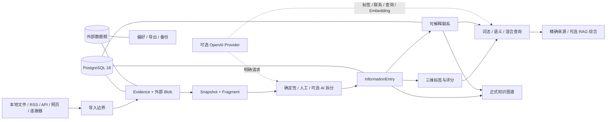

# StruInfo

<div align="center">

**把文档变成可追溯、可检索、可编辑的个人知识网络。**

Self-hosted, traceable document processing and personal knowledge workspace.

[](https://github.com/tntexploding/StruInfo/releases/latest)
[](https://github.com/tntexploding/StruInfo/actions/workflows/quality.yml)
[](LICENSE)
[](package.json)
[](docs/production-operations.md)

[功能概览](#功能概览) · [工作流](#六步工作流) · [快速开始](#快速开始) · [Docker 部署](#docker-部署) · [项目文档](#项目文档)

</div>

StruInfo 是一个面向单一所有者的私人资料整理与知识维护工作台。它保存原始证据，
把文档拆成可管理的 `InformationEntry`，再通过三维标签、可解释联系、检索和可编辑关系图谱，
把零散资料整理成能够回到精确来源的个人知识网络。

项目支持完整的无 AI 工作流；配置 Provider 后，可以按需增加拆分、标签、联系、查询综合、
Embedding 和 RAG 能力。AI 只在明确的功能边界内工作，不会取代原始资料、人工编辑权或来源追溯。

> [!IMPORTANT]
> StruInfo 当前是私人单用户应用，不是公共多用户 SaaS 或开放 API。应用端口应保持在宿主回环或
> 私有网络内；远程访问必须经过 HTTPS + 认证反向代理、VPN 或 SSH 隧道。

## 为什么使用 StruInfo

- **从原文出发**：原始文件、规范化内容、Snapshot 和 Fragment 形成可追溯证据链。
- **处理过程清楚**：导入、拆分、标签、联系、查询和正式知识各自拥有独立工作页面。
- **不依赖 AI**：人工操作和确定性规则始终可用；AI 是显式启用的增强项。
- **知识可维护**：相似联系不会冒充已核验事实，用户可以编辑、削弱、屏蔽或恢复关系。
- **隐私默认收敛**：私人内容默认不进入普通检索，查看、查询和关系展示都需要显式放宽范围。
- **资料与代码分离**：文档、数据库、Blob、偏好、配置、密钥、导出和备份均位于仓库与镜像之外。

## 六步工作流

| 页面     | 主要工作                                                          | 结果                                   |
| -------- | ----------------------------------------------------------------- | -------------------------------------- |
| **导入** | 导入本地文件，或检查 GitHub、RSS/Atom、JSON API、网页及连接器订阅 | 不可变原始证据、Snapshot 与 Fragment   |
| **拆分** | 使用确定性规则、人工分组/范围切分或可选 AI 提案整理文档结构       | 当前 `InformationEntry` 集合           |
| **标签** | 编辑内容、类型、领域三维关键词，并记录有用/有趣评分               | 可搜索、可聚合的 Entry 与文档标签      |
| **联系** | 查看可解释的相似候选，调整全局权重或逐对编辑关系                  | 自动联系投影与持久人工覆盖             |
| **查询** | 使用词法、语义或混合检索，按来源、时间、标签、隐私和关系筛选      | 带精确来源的稳定结果及可选 RAG 综合    |
| **知识** | 选择 Entry 作为中心，查看和编辑有界关系图谱                       | 正式关系语义、说明、核验状态与双端来源 |

“总览”页面独立展示外部工作区统计、ProcessingRun 状态与可执行任务，不伪造未运行的 AI 进度。

## 功能概览

### 文档与订阅

- 本地 `.md`、`.markdown`、`.txt`、`.html`、`.htm` 和带文本层 `.pdf`；
- GitHub 仓库中的公开 Markdown 文件；
- RSS/Atom 订阅；
- 声明式 JSON API；
- 受限同源网页抓取；
- 已安装且受信任的来源连接器；
- 原始字节保存在外部内容寻址 Blob 根，HTML/PDF 仅生成供处理使用的 Markdown 投影。

### 拆分与标注

- CommonMark/结构规则拆分、人工 Fragment 分组、Unicode 范围切分；
- 拆分前派生文本修改，不改写不可变原始证据；
- 内容、类型、领域三个相互独立的关键词维度；
- 有用程度、兴趣程度两个五档人工评分；
- 确定性关键词建议、确认别名、排除项、个人快捷标签与外部偏好规则；
- 可选 AI 拆分与标签提案，接受前不直接写入正式 Entry。

### 联系与知识图谱

- 由内容、类型、领域信号组成的可解释相似度；
- 可版本化的全局权重与阈值；
- 逐对增强、削弱、屏蔽、恢复和用户自定义联系；
- Entry 中心的有界知识图谱，支持八类关系语义、方向、说明和来源核验状态；
- 自动相似边始终标明为计算结果，人工覆盖优先于后续重建。

### 搜索、语义检索与 RAG

- 标题、正文、标签和来源的精确、子串与拼写容错词法检索；
- 词项索引、可选向量索引及词法/语义混合召回；
- 来源、时间、标签、Entry 类型、隐私范围和一至两跳联系过滤；
- 稳定排序、游标分页、结果对比与精确 Snapshot/Fragment 来源返回；
- 基于当前本地结果和证据句柄的可选查询综合与 RAG，不把 Provider 回答当作新的原始证据。

### 个人数据与恢复

- PostgreSQL 18 保存 Evidence、Entry、标签、联系、处理任务和兼容历史状态；
- 外部数据根保存 Blob、个人偏好、订阅游标、连接器配置引用、导出和备份；
- 个人数据包可携带当前工作区数据库分区、引用 Blob 字节和偏好；
- 备份只能恢复到已经迁移且业务为空的同一 workspace，避免覆盖非空状态；
- Git、npm 包和容器镜像只包含代码、迁移、协议和合成测试资料。

## 系统结构



后端是模块化 TypeScript 单体，同一构建可按 API、scheduler、worker 或 `all` 角色运行；
Web 使用 React/Vite。所有领域写入都通过窄边界进入 PostgreSQL，原始内容和个人偏好不会编译进应用包。

## 快速开始

### 开发与质量验证

要求：Node.js `>=24.18.0`、Corepack、pnpm `11.20.0`。

```bash
git clone https://github.com/tntexploding/StruInfo.git
cd StruInfo
corepack enable
pnpm install --frozen-lockfile
pnpm verify
```

`pnpm verify` 会执行格式、ESLint、TypeScript、单元测试、集成测试、构建、制品边界和部署静态检查。

本机运行还需要 PostgreSQL 18、仓库外 runtime 配置、独立数据库 URL secret 和可写外部数据根。
配置完成后：

```powershell
$env:STRUIINFO_CONFIG_PATH = 'C:\StruInfo\config\runtime.env'
$env:DATABASE_URL_FILE = 'C:\StruInfo\secrets\runtime-database-url.txt'
corepack pnpm run start:all
```

默认地址为 <http://127.0.0.1:3000>，按 `Ctrl+C` 优雅停止。首次数据库准备、角色权限和完整配置见
[生产运行与维护手册](docs/production-operations.md)与
[运行配置说明](docs/runtime-configuration.md)。

## Docker 部署

生产 Compose 边界使用非 root 用户、只读根文件系统、能力清空和 `no-new-privileges`，
并把 Web/API 端口限制在宿主回环。外部 PostgreSQL、数据根、runtime 配置和两个数据库 URL secret
必须在仓库与镜像之外准备。

固定操作顺序是：

```bash
docker compose -f compose.production.yaml build
docker compose -f compose.production.yaml -f compose.maintenance.yaml --profile maintenance run --rm migrate
docker compose -f compose.production.yaml -f compose.maintenance.yaml --profile maintenance run --rm prepare-queue
# 数据库所有者执行 deploy/postgresql/apply-runtime-grants.sql
docker compose -f compose.production.yaml --profile maintenance run --rm preflight
docker compose -f compose.production.yaml up -d app
```

Compose 需要四个指向外部绝对路径的变量：

```text
STRUIINFO_RUNTIME_CONFIG_FILE
STRUIINFO_DATA_ROOT
STRUIINFO_RUNTIME_DATABASE_URL_SECRET_FILE
STRUIINFO_MIGRATION_DATABASE_URL_SECRET_FILE
```

不要直接把应用端口或 PostgreSQL 暴露到公网。远程私人部署应使用
[Caddy 示例](deploy/reverse-proxy/Caddyfile.example)在宿主侧提供 HTTPS 与单用户认证。
升级、备份、空库恢复、健康检查和云端检查清单均在
[生产运行与维护手册](docs/production-operations.md)中给出。

## AI 是可选能力

未配置 Provider 时，导入、人工/确定性拆分、标签、联系、词法搜索、正式知识图谱、导出和恢复仍可运行。
启用 AI 时，目前只开放以下窄能力：

- 对选定公开 Snapshot 生成拆分提案；
- 对选定公开 Entry 生成标签提案；
- 对选定公开 Entry 对生成联系提案；
- 对当前有限公开查询结果进行证据约束综合；
- 生成可重建 Embedding，供语义/混合检索与本地来源约束 RAG 使用。

密钥只通过环境变量或外部 secret 文件注入。私人 Entry/Snapshot 不会因为启用了 AI 就自动发送给 Provider，
提案也不会绕过用户或既有写入边界直接修改正式状态。

## 隐私与安全边界

- 普通查询默认排除私人 Entry、私人文档及涉及私人端点的关系；
- `包含隐私` 与 `只看隐私` 是当前请求的显式范围，不是持久的全局放宽；
- 完整私人文档只在明确允许时通过独立结果通道返回；
- 日志不得记录文档正文、数据库 URL、Provider key 或个人路径；
- 应用面向单一所有者，不提供账户体系、租户隔离或公共写 API；
- 安全问题请使用 GitHub 私密漏洞报告，不要在公开 Issue 中提交凭据或私人资料。

详见 [Security Policy](SECURITY.md)。

## v0.1.0 发行状态

首个私人单用户版本已经完成本地 Docker Desktop + PostgreSQL 18 发布演练。

| 验证项         | v0.1.0 结果                                                 |
| -------------- | ----------------------------------------------------------- |
| GitHub Actions | Windows 与 Ubuntu `Quality` 矩阵通过                        |
| 单元测试       | 142 个测试文件，882 项通过                                  |
| 集成测试       | 2 个测试文件，4 项通过                                      |
| 浏览器验收     | 11 项端到端场景通过                                         |
| 应用构建       | React/Vite 80 modules                                       |
| 制品边界       | 1,029 个发行文件；测试、fixture、个人数据路径 0 命中        |
| 生产依赖审计   | `pnpm audit --prod --audit-level=low` 无已知漏洞            |
| 容器扫描       | Trivy HIGH 0 / CRITICAL 0                                   |
| 运行演练       | 迁移、队列、权限、preflight、健康、备份、空库恢复与重启通过 |

这些结果证明的是当前单机私人部署基线，不代表公共多用户服务、云编排、跨租户权限或任意公网暴露已经实现。
请参阅 [v0.1.0 发行说明](https://github.com/tntexploding/StruInfo/releases/tag/v0.1.0)
和 [Changelog](CHANGELOG.md)。

## 仓库结构

```text
apps/server/       API、任务角色、领域模块、PostgreSQL 与外部适配器
apps/web/          React/Vite 单页应用
packages/          共享合同与测试支持
deploy/            runtime 模板、权限 SQL 与反向代理示例
docs/              产品需求、架构、ADR、运行与发布文档
tests/             合成集成与端到端测试
tools/             制品、依赖、性能和部署验证工具
```

## 项目文档

- [当前项目状态与实现清单](docs/current-project-state.md)
- [产品需求](docs/product-requirements.md)
- [路线图](docs/roadmap.md)
- [知识核心与个人数据边界](docs/knowledge-core-architecture.md)
- [本地 HTTP 接口](docs/m1c-local-http-api.md)
- [运行配置](docs/runtime-configuration.md)
- [生产运行与维护](docs/production-operations.md)
- [个人数据包合同](docs/workspace-bundle-contract.md)
- [文档条目处理准则](docs/document-entry-processing-guidelines.md)
- [决策日志与 ADR](docs/decision-log.md)
- [依赖 SBOM](docs/dependencies/sbom/npm-closure.spdx.json)

历史合同和验收证据仍保存在 `docs/`，但旧合同不代表对应运行时仍然公开。
判断当前产品能力时，以[当前项目状态与实现清单](docs/current-project-state.md)为准。

## 参与项目

提交代码前请阅读 [CONTRIBUTING.md](CONTRIBUTING.md)。贡献必须保持仓库和发行包无个人数据，
测试只使用合成、无个人含义的 fixture；可达的产品问题应修复，纯强化项不应阻塞核心开发。

StruInfo 使用 [MIT License](LICENSE)。第三方材料仍分别遵循
[第三方声明](THIRD_PARTY_NOTICES.md)及随制品保留的原始许可证。
