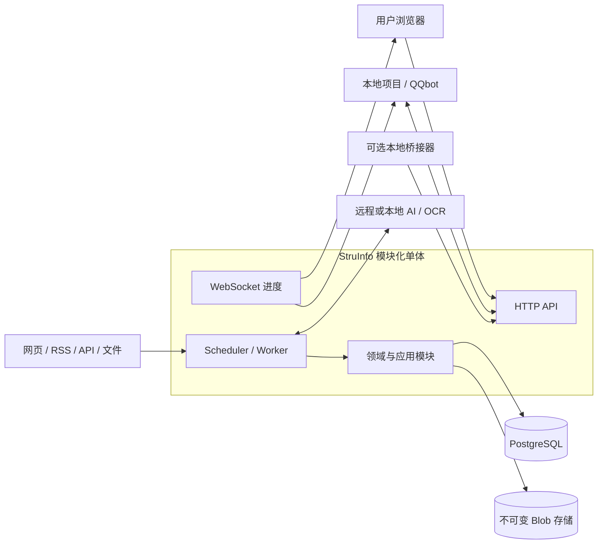

# StruInfo 开发大纲

- 状态：M1J 正式知识关系语义、维护说明与来源核验已完成
- 最近更新：2026-08-27
- 对应需求：[产品需求](product-requirements.md)
- 对应计划：[分阶段计划](roadmap.md)
- 当前实现：[当前项目状态与实现清单](current-project-state.md)
- 基础 ADR：[ADR 0001](adr/0001-typescript-modular-monolith.md)、
  [ADR 0002](adr/0002-postgresql-persistence-and-durable-work.md)、
  [ADR 0003](adr/0003-m0-s-engineering-foundation.md)、
  [ADR 0004](adr/0004-adaptive-knowledge-ingestion-and-policy-authorized-writes.md)、
  [ADR 0005](adr/0005-versioned-knowledge-core-and-ai-optional-operations.md)、
  [ADR 0006](adr/0006-external-configuration-and-personal-data-isolation.md)、
  [ADR 0007](adr/0007-information-entry-first-document-processing.md)、
  [ADR 0008](adr/0008-current-entry-state-and-portable-personal-data.md)、
  [ADR 0009](adr/0009-retire-superseded-m1c-runtime.md)、
  [ADR 0010](adr/0010-entry-centered-formal-knowledge-graph.md)、
  [ADR 0011](adr/0011-association-derived-formal-graph-edges.md)、
  [ADR 0012](adr/0012-provider-neutral-processing-runs-and-proposals.md)、
  [ADR 0013](adr/0013-openai-entry-tag-proposals.md)、
  [ADR 0014](adr/0014-openai-entry-association-proposals.md)、
  [ADR 0015](adr/0015-openai-entry-split-proposals.md)、
  [ADR 0016](adr/0016-manual-entry-fragment-grouping.md)、
  [ADR 0017](adr/0017-manual-within-fragment-entry-boundaries.md)、
  [ADR 0018](adr/0018-local-text-file-import.md)、
  [ADR 0019](adr/0019-local-html-pdf-import.md)、
  [ADR 0020](adr/0020-explainable-lexical-entry-search.md)、
  [ADR 0021](adr/0021-query-association-and-result-comparison.md)、
  [ADR 0022](adr/0022-evidence-bounded-ai-query-synthesis.md)、
  [ADR 0023](adr/0023-deterministic-entry-exploration-policy.md)、
  [ADR 0024](adr/0024-versioned-git-source-subscriptions.md)、
  [ADR 0025](adr/0025-explainable-entry-preference-profile.md)、
  [ADR 0026](adr/0026-entry-automation-policy-dry-run.md)、
  [ADR 0027](adr/0027-recoverable-entry-automation-routing-execution.md)、
  [ADR 0028](adr/0028-owner-controlled-entry-automation-routing.md)、
  [ADR 0029](adr/0029-entry-automation-control-integrity.md)、
  [ADR 0042](adr/0042-formal-knowledge-relation-semantics-and-source-review.md)

## 1. 结论

> 本文同时保留长期目标架构和历史实施证据。判断“当前代码是否可用”时，以[当前项目状态与实现清单](current-project-state.md)为准；本文中尚无活动入口的 AI、WebSocket、旧 KnowledgeItem 编辑器、向量、报告和部署组件都是目标，不是现状。

StruInfo 首版采用“单仓库、模块化单体、多运行角色”架构。

推荐技术方向是：

- Node.js 24 LTS 与严格模式 TypeScript 作为主要运行时和语言；
- React 与 Vite 提供浏览器界面；
- NestJS 只负责应用装配、HTTP、WebSocket 和运行时适配；
- PostgreSQL 18 保存业务真相，`pgvector` 只保存可重建的向量索引；
- Drizzle ORM 提供薄、类型安全的 SQL 与迁移层，并保留显式 SQL 通道；
- `pg-boss` 在 PostgreSQL 中提供定时任务、重试和后台执行；
- 原始网页、文本和图片进入内容寻址的 Blob 存储，不塞入关系表；
- 用户、确定性解析器、声明式规则、导入器和 AI 共用同一套知识命令与变更集；AI、OCR 和未来的视频处理通过可选稳定接口接入，模型适配器不能直接修改正式知识；
- 工程代码与实际运行配置、工作区数据、Blob/导出/备份和秘密存储完全分离；个人值不进入 Git、测试 fixture 或正式包体；
- Windows 开发与 Linux 部署使用相同数据库和迁移，不以 SQLite 模拟生产；
- 首版不引入微服务、图数据库、独立搜索集群、Redis 或平台专属 QQ 逻辑。

该方向已由 [ADR 0001](adr/0001-typescript-modular-monolith.md) 与
[ADR 0002](adr/0002-postgresql-persistence-and-durable-work.md) 正式接受。
M0-P 证明的是架构可行性，不是生产认证；任何探针候选源码都不得直接复制到生产树。
M0-S 已精确锁定工具和依赖版本，并建立最小脚手架、首方迁移 runner、CI、许可证记录与统一质量命令；该工程地基由 [ADR 0003](adr/0003-m0-s-engineering-foundation.md) 接受。
自适应摄取、偏好/探索分离和策略授权知识写入由 [ADR 0004](adr/0004-adaptive-knowledge-ingestion-and-policy-authorized-writes.md) 接受。
[ADR 0005](adr/0005-versioned-knowledge-core-and-ai-optional-operations.md) 已接受版本化正式知识核心和无 AI 确定性检索；[ADR 0006](adr/0006-external-configuration-and-personal-data-isolation.md) 已接受个人数据隔离要求；[ADR 0007](adr/0007-information-entry-first-document-processing.md) 把普通文档主线重定向为 Entry-first。ADR 0008 随后把普通 Entry、文档标签和人工联系收敛为当前成品态与可携带个人数据，ADR 0009 删除了没有活动调用方的旧 Curation/Knowledge 应用运行时。ADR 0010 将新的所有者正式知识页定义为有界中心图谱；ADR 0011 进一步允许确定性相似联系
直接成为可编辑图谱边，并让用户编辑或 block 优先于后续重建。

当前产品已经提供导入、确定性/人工拆分、标签、联系、查询、正式 Entry 图谱、精确来源、隐私范围与完整个人数据包。M1E-2 复用 Association 投影与 override，实现最高匹配中心、有界图/列表和用户关系命令；M1J 在同一边界上增加八类关系语义、维护说明、来源核验、双端来源动作和 Association Bundle v4。M1E-3A–D 增加任务状态及可选的拆分、标签和 selected-pair 联系提案；M1E-4A/4B 让用户在首次 Entry 物化前直接合并既有 Fragment、在既有边界或 Fragment 内 Unicode 标量边界拆开并编辑标题；M1E-5A/5B 让本地 UTF-8 Markdown/文本/HTML/PDF 进入既有 Evidence 与 Split 主线。活动工作区目前按所有者要求保持零业务数据，旧资料只存在于项目目录外的恢复归档。

## 2. 为什么选择这个形态

StruInfo 的主要复杂度来自证据版本、知识修订、长任务恢复、幂等、审计和外部集成，而不是请求吞吐量。
在这些边界尚未被真实使用验证时拆成微服务，会把模块调用变成网络调用，并提前增加部署、追踪和一致性成本。

模块化单体保留清楚的领域边界，同时允许同一构建产物按不同角色启动：

- 开发阶段可在一个进程中同时运行 API、调度与 Worker；
- Linux 正式环境可拆为 API、Scheduler 和 Worker 进程；
- 角色拆分不改变模块接口，也不要求立即拆仓库或拆数据库；
- 只有出现独立扩缩容、隔离或发布节奏证据时，才考虑提取服务。

TypeScript 相比 Python 主后端，避免 Windows 后台任务生态差异，也保留良好的网页采集、流式 AI 和全栈开发体验。
相比 C#/.NET，TypeScript 能让前端、后端、契约和大多数适配器共用一种语言，降低个人项目的上下文切换。
.NET 10 LTS 仍是可信备选；如果维护者明显更熟悉 C#，或首版需要 Windows Service 和大量进程内 CPU 工作，应重新评审 ADR 0001。

## 3. 系统上下文



生产环境需要访问用户本地项目时，本地桥接器主动建立受认证的出站连接。
云端服务不得主动扫描或直接暴露用户局域网。

## 4. 核心工程原则

1. 来源、快照、文档结构、InformationEntry、处理提案与正式知识分层保存；AI 产物只是处理提案的一种来源。
2. 领域规则不依赖 NestJS、数据库、模型供应商、文件路径或 QQ API。
3. 模块只能通过公开应用接口协作，不能跨模块直接改表。
4. HTTP 是命令与查询的权威接口；WebSocket 只是可丢失的实时视图。
5. 任务与事件按可能重复执行设计，副作用由幂等键和唯一约束保护。
6. 索引、向量和树视图都是可重建派生物，不是知识真相源。
7. 外部网页、模型输出和媒体文件都是不可信输入。
8. 先在无 AI 条件下完成一个真实信源的证据、Entry 标注/关联/搜索和可选正式知识闭环，再接 AI、偏好、更多格式、报告、连接器和自治能力。
9. 工作区身份属于资源键、查询、缓存、幂等与事件边界，不能只靠调用方记得过滤。
10. 外部 JSON 使用标准兼容的运行时 schema 和原始字节级重复成员检查；任意程序对象不能绕过数据边界。
11. 成功写出的状态、导出和证据工件必须能被同版本公开 reader 读回；资源预算包含完整编码包络。
12. WebSocket 是可恢复投影；快照、重放截止点和事件尾流必须来自一致且可核验的读取模型。
13. 内容分类、准入动作、知识类型、认知角色、审核状态和操作来源是独立维度，不能用一个标签或状态替代。
14. 稳定 Entry 与正式知识身份、不可变修订、引用、派生和版本化用户控制构成规范事实；自动关联基础分、树、布局、搜索索引、向量和 AI 摘要均可重建。
15. 应用安装物不携带任何个人知识、类别、偏好、信源或真实配置；所有个人数据根必须位于仓库和安装目录之外。

## 5. 模块边界

| 模块 | 拥有的数据与职责 | 明确禁止 |
| --- | --- | --- |
| `access` | 用户、工作区、会话、权限和策略 | 把单用户假设写成无工作区的数据模型 |
| `sources` | Watch、Endpoint、Git/网页/API/文件入口、抓取计划、游标和来源适配器 | 直接产生正式知识或扩大采集范围 |
| `evidence` | Resource、Snapshot、DocumentNode、Fragment、MediaAsset/Usage、Blob 元数据和证据定位 | 覆盖不可变快照或把解析结构冒充正式知识 |
| `entries` | InformationEntry/Revision、证据输入、内容/类型/领域关键词、文档标签、AssociationProjection/Override | 重写 Snapshot/Fragment；把可能相关关联冒充正式 KnowledgeRelation；保存个人默认词表到代码 |
| `curation` | 证据目标上的 VocabularyTerm/ContentClassification、IntakeDecision、Assessment、用户反馈、PreferenceProfile、ExplorationPolicy 和 AutomationPolicy | 把内容分类、准入动作、兴趣、探索价值和事实可靠性压成一个字段或分数；直接修改证据或正式知识 |
| `processing` | Operation、可选处理计划、确定性/AI/OCR 运行、KnowledgeChangeProposal 和插件编排 | 直接创建或更新 KnowledgeRevision |
| `knowledge` | 正式知识目标上的分类指派、Candidate、KnowledgeChangeSet、KnowledgeItem/Revision/Alias、Citation、Derivation、Relation/Revision、Collection/Placement、SavedView、ConflictCase 和授权提交 | 让模型、来源或传输适配器直接改知识表，或用复制正文实现重组 |
| `retrieval` | 结构化过滤、精确/别名/子串匹配、关系遍历、可选向量、树、时间线和混合查询 | 把索引、向量或 AI 答案当成唯一数据副本 |
| `digests` | 后续日报/周报、时间窗口、排序和 Delivery | 在知识核心完成前成为正式知识唯一入口 |
| `integrations` | HTTP 契约、WS 事件、Webhook 订阅、投递和外部项目授权 | 在核心中加入 QQ 平台细节 |
| `platform` | 数据库、Blob、队列、事务性 outbox、配置、日志、指标和秘密引用 | 承载产品领域规则 |

每个业务模块内部按需要分成 `domain`、`application`、`ports` 和 `adapters`。
不为没有第二种实现或清楚测试价值的对象提前创建接口。

## 6. 关键数据流

### 6.1 采集与入库

```text
Watch / Endpoint / ManualInput / LocalTextFile
  -> FetchRun (when acquisition is remote)
  -> Resource
  -> immutable Snapshot
  -> DocumentNode + Fragment + MediaAsset/Usage
  -> ContentClassification + independent IntakeDecision
  -> InformationEntry + immutable EntryRevision
  -> content / type / domain keyword assignments
  -> deterministic Entry search + optional association projection/override
  -> optional formalization when stable semantic knowledge is useful
  -> user command / deterministic parser / declarative rule / import / AI proposal
  -> KnowledgeChangeSet
  -> user command or versioned policy authorization
  -> Candidate only when review is required
  -> KnowledgeItem + KnowledgeRevision + Alias/Relation/Citation/Derivation
  -> transactional outbox event
```

来源适配器的终点是 `Snapshot`，不是 `InformationEntry` 或 `KnowledgeItem`。
证据解析器可以创建文档结构、片段和媒体用途提案，但不能把它们直接声明为正式知识。
内容分类只回答“这是什么”，`IntakeDecision` 只回答“如何处理”；分类为“小说”不能自动推断准入动作。
人工命令、确定性解析器、规则、导入器与 AI 可以产生相同的规范变更形状。AI 的终点是带证据、处理计划和模型身份的 `KnowledgeChangeProposal`；模型适配器不能写知识表。
`curation` 记录人工决定、偏好/探索规则和自动化授权，`knowledge` 将提案规范化为 `KnowledgeChangeSet`，核验动作、工作区、证据、幂等键和授权范围后再提交。
正式知识只能由 `knowledge` 模块的应用用例创建或修订。调用依据可以是当前用户命令，也可以是用户已启用的具体 `AutomationPolicy` 版本；不确定或高影响动作登记为 `Candidate`/审核项。

整份资料获准处理不表示所有原子变更无条件获准。授权需要按动作区分新增、非破坏性修订、关系补充、合并、删除、冲突裁决和结构重排。

### 6.2 查询

```text
query request
  -> Entry keyword/source/document/privacy filters
  -> Entry exact/Unicode substring/local fuzzy retrieval
  -> bounded Entry association traversal
  -> optional formal knowledge filters and relation traversal
  -> Entry/knowledge revisions + fragments + deterministic match reasons
  -> optional vector recall
  -> optional live evidence capture
  -> optional AI synthesis
  -> records or answer + per-claim citations + uncertainty
```

首个切片只查询私人知识、来源和处理记录，并直接返回可排序、可过滤、可追溯的确定性结果。实时网页只有先产生快照和片段，才能支持可保存回答或进入 `KnowledgeChangeSet`；在线结果不因生成了流畅答案而自动成为正式知识。AI 未配置、禁用或失败时，查询不应进入错误态。

### 6.3 报告与推送

该数据流在知识摄取与检索核心稳定后实现，不属于首个产品切片。

```text
schedule window
  -> select new candidates
  -> deduplicate and rank
  -> generate cited digest
  -> persist Digest
  -> enqueue outbox event
  -> signed Webhook delivery
  -> receiver deduplication by event_id
```

日报和投递分别记录状态。
成功生成报告不等于成功送达，推送失败也不能让报告消失。

## 7. 状态与幂等模型

不要用一个“处理中/完成”状态覆盖整个链路。

```text
Operation: queued -> running -> retry_wait -> running
                              -> succeeded | failed | cancelled

IntakeDecision: pending -> full | structured | condensed
                        -> source_only | ignored | needs_review

ContentClassification: versioned vocabulary assignment; no workflow transition

AutomationPolicy: draft -> trial -> active -> paused | retired

KnowledgeChangeSet: proposed -> authorized -> committed
                             -> review_required -> authorized | rejected
                             -> superseded

Candidate: pending_review -> authorized | rejected | superseded

Delivery: pending -> sending -> delivered
                            -> retry_wait -> sending
                            -> dead_letter
```

已提交的知识修订保持不可变。所谓撤回或回滚通过新的补偿修订及 `reverted_by`/`supersedes` 关系表达，不把 `committed` 状态改回未提交，也不删除原证据和授权历史。
`ContentClassification` 是可版本化的工作区词表赋值，不是状态机。修改分类不会暗中修改 `IntakeDecision`、知识修订或审核状态。

公开的 `Operation` 记录业务阶段、进度、父任务、尝试次数、下一次重试、错误码和关联 ID。
`pg-boss` 负责耐久调度与任务领取，但其内部 ID 不作为公共 API 的稳定标识。

实现约束：

- 所有外部可重试写操作接受 `Idempotency-Key`，并把工作区与规范请求身份纳入幂等范围；
- 自动知识提交把策略 ID、策略版本、动作类型和规范提案身份纳入授权与审计；停用策略后不得继续领取新的授权工作；
- 幂等记录必须在业务事务内原子地“插入或解析冲突”，相同请求精确重放，不同请求返回稳定冲突；
- 更新知识时携带修订号或 `ETag/If-Match`，避免静默覆盖；
- Worker 可能在超时或崩溃后再次执行，处理器必须幂等；
- Worker 与投递领取使用带 owner/generation token 的 compare-and-set；必须检查受影响行数，并为租约定义到期语义；
- 外部副作用发生前先提交耐久 attempt 身份；结果写入必须同时匹配预期状态与 exact claim/attempt token；
- 终态单调不可回退，迟到或已被替代的结果不得覆盖成功、确认或更新后的状态；
- 入库变更与 outbox 事件在同一 PostgreSQL 事务提交；
- Webhook 至少一次投递，接收方按稳定 `event_id` 去重；
- 对发送消息等外部副作用，不宣称端到端“恰好一次”；
- 序列化冲突和死锁重试必须有界、可观察，并保持相同幂等语义。

业务模块在 Unit of Work 中通过端口登记领域事件或后续任务，不直接写 `platform` 表。
PostgreSQL 适配器在同一事务中提交业务变更，并分别把内部后台工作写入 `pg-boss`、把需要送往外部的事件写入 outbox。
Outbox Delivery Worker 直接租用 outbox 行并执行 Webhook 投递，不再把同一外部事件复制到第二条队列。
任何 claim、状态转换和事件追加都必须由同一受保护的事务决定；未经成功 compare-and-set 的执行者不能追加事件或提交结果。

计划时间使用 IANA 时区名称，实际执行时刻保存为 UTC 瞬间。
遇到 Windows 休眠、停机或夏令时变化时，日报类任务默认只补跑一次最近遗漏窗口，不批量重放每个错过的触发点；具体 Watch 可以显式改为跳过。

## 8. 持久化与检索

### 8.1 PostgreSQL

Windows 开发与 Linux 正式环境都使用 PostgreSQL 18。
这样可以在进入生产前真实验证事务、约束、递归查询、任务领取、中文检索和向量行为。

Drizzle 作为薄 SQL 层的候选原因是它支持 PostgreSQL、显式迁移和 `pgvector` 类型及索引。
复杂查询允许使用有参数绑定、有集成测试的原生 SQL，不为了 ORM 纯洁性隐藏数据库能力。

关系表保存：

- 工作区、来源、抓取运行和游标；
- 快照、文档结构、片段、媒体身份与用途元数据；
- 工作区词表、内容分类及其赋值历史；
- 准入决定、分维度 Assessment、用户反馈、偏好/探索和自动化策略版本；
- 可选处理计划、确定性/AI/OCR 运行、知识变更集、候选和审核；
- 稳定知识项、不可变修订、别名、修订级引用、派生、稳定关系及关系修订与冲突案例；
- 集合、排序成员、树位置、保存查询、报告、投递、操作、outbox 和审计；
- Blob 的逻辑 ID、内容哈希、大小、类型和保留状态。

所有私有业务记录都带工作区边界。
工作区身份必须进入仓储键、SQL 谓词、唯一约束、缓存键、历史/事件查询和幂等范围；授权检查与资源选择使用同一个有效工作区，不能只依赖 URL 前置检查、opaque ID 或调用方记得过滤。
时间字段使用 `timestamptz` 表示确定瞬间，同时保留原始时区、精度和是否由 AI 推断；发布时间、事件时间、有效时间、抓取时间和入库时间继续分列。
Snapshot 分别记录原始响应哈希和规范正文哈希，正文规范化算法也需要版本，避免把版式变化误判为知识变化。

`KnowledgeItem` 和 `KnowledgeRelation` 提供稳定身份；语义内容、关系类型、方向、范围或证据变化创建不可变修订。引用固定到明确的知识/关系修订和 Fragment，编辑后的语义不能自动继承旧引用。重组使用 Collection、Framework、OrderedMembership、TreePlacement 和 SavedView 引用既有知识，不复制规范正文。

核心字段使用受约束的关系列。只有类型特有、schema 版本化且经过运行时校验的扩展才进入 `jsonb`；不采用无限制 EAV 或任意 JSON 文档作为知识真相。

### 8.2 Blob 存储

大文本、原始响应、图片和未来视频保存为不可变 Blob。
首版实现本地文件系统适配器，文件名由内容哈希派生，业务记录只引用逻辑 Blob ID。

切片 0 已以全新生产模块实现本地适配器，没有复用 M0-P 探针候选源码。外部数据根固定分为 `blobs/`、`uploads/`、`exports/` 和 `backups/`；只有 `blobs/sha256/<前两位>/<次两位>/<完整摘要>` 当前具有文件系统 byte-store reader/writer。其余三个区域仍未开放文件落盘用例。

当前低层端口接收字节并返回 SHA-256 内容身份，默认拒绝大于 64 MiB 的单个 Blob；它不暴露原始文件路径，也不承担工作区授权。逻辑 Blob ID、工作区所有权、引用计数/保留状态和传输层授权由后续数据库与应用服务组合，未来 S3 兼容适配器必须保持这些上层身份稳定。

Blob 边界只接受通过 intrinsic brand 检查的普通字节视图，并立即复制精确可见范围。
长度、内容哈希、Blob 身份、后续解析与保留字节都基于同一份 owned copy；不得通过 Proxy、accessor、共享可变 buffer 或调用方随后修改来重定向来源身份。

状态、导出和证据包分别定义版本化 reader/writer 预算。
预算包含 UTF-8 包络、base64 膨胀和全部字段；writer 在提交前测得最终字节数，超限时可见且原子失败。
大型正文和媒体优先保留为 Blob 引用，不能通过反复嵌套 base64 形成不可读的 current-version 工件。
writer contract 与边界测试必须证明每个成功输出都能由相同版本的公开 reader 往返读取；若确定性 encoder 与精确 preflight 已提供同等保证，运行时不要求为每次写入重复解析。

切片 0 已实现[工作区 Bundle v1 信封](workspace-bundle-contract.md)：模块通过注册的 `type + version` codec 提供闭合 payload。当前五分区个人数据包包含 36 表 M1C 兼容分区、9 表 Entry v5、2 表 Association v4、14 表 Processing v7，以及引用 Blob 字节和偏好，共覆盖 61 张当前工作区表。Entry v4 在既有精确 Fragment 范围上增加唯一当前结构事实并向后读取 v1–v3；Entry v5 增加拆分前唯一全文工作副本并向后读取 v1–v4；Association v4 在 v3 的关系来源、名称和方向上增加闭合语义、维护说明和来源核验状态，并向后读取 v1–v3；Processing v7 增加 typed 确定性推进动作。所有文件仍只落到外部 `exports/`。跨工作区克隆、非空合并和生产灾难恢复仍是独立后续能力。

Linux 单机部署可先使用受备份保护的持久卷。
需要多机或对象存储服务时，再增加 S3 兼容适配器；迁移不能改变 Resource、Snapshot 或 Citation ID。

不可变表示已保存的字节不会被原地改写，不表示永不删除。
每个逻辑 Blob 都属于工作区，并通过显式引用与 Snapshot、Fragment 或处理运行关联；失去全部有效引用且超过保留期后才能进入垃圾回收。
删除请求立即撤销普通读取并留下审计状态，物理字节和备份副本按公开的清理窗口删除；不能把异步清理描述成即时物理擦除。

Fragment locator 与 trusted binding 绑定到明确的工作区、Resource、Snapshot、Blob 和知识修订上下文。
Citation 指向具体 KnowledgeRevision；编辑后的语义不能自动继承旧引用。

### 8.3 搜索

搜索按证据逐步升级：

1. 先按工作区、类型、分类、审核状态、来源、时间和其他结构字段过滤；
2. 对规范标题、别名和稳定标识做精确匹配；
3. 对标题、别名和当前修订正文做中文原文子串匹配；
4. 用真实中文样本评估 `pg_trgm` 的召回率、排序质量与索引大小；
5. 对明确关系类型做有界递归遍历，并返回路径和方向；
6. 需要语义召回且有真实指标时，在 PostgreSQL 中启用 `pgvector`；
7. 启用 AI 时，才在已经找回的记录上做查询扩展或带引用综合；
8. 只有单库检索无法达到已量化目标时，才评估独立搜索引擎。

`SearchProjection` 保存当前修订的规范化可检索字段和聚合键，是可重建读取模型。每个结果都返回匹配字段、过滤条件、关系路径、当前修订和来源摘要；确定性搜索本身不依赖 Embedding 或 AI。

知识关系先用带方向、类型、版本和审核状态的关系表表达。
树视图使用 `TreePlacement`，递归查询不足以满足真实规模前不引入图数据库。

## 9. AI、中文与媒体处理

### 9.1 AI 边界

AI 是可选生产力适配器，不是启动依赖、数据库一致性依赖或唯一搜索入口。没有 Provider、模型凭据或 Embedding 时，系统必须正常提供人工摄取、分类、拆分、编辑、关系、重组、冲突、历史、确定性搜索、导出、备份和恢复，并把 AI 功能显示为“未启用”而不是系统故障。

应用层定义小而稳定的能力接口，例如：

- `TextGenerationProvider`；
- `EmbeddingProvider`；
- `DocumentExtractor`；
- `OcrProvider`；
- `MediaProcessor`。

每次处理至少记录：供应商、模型、提示模板版本、处理计划版本、参数、输入引用与哈希、原始输出、规范化输出、耗时、用量、费用、警告和错误。
模型输出必须通过经审查、符合所声明 JSON Schema dialect 与关键字子集的运行时校验；`if/then/else`、引用、组合和 closed-object 语义不能由不完整的自制 evaluator 代替。
原始 JSON 在 materialization 前拒绝重复成员；程序化数据只接受普通、稠密且由 own data property 组成的 record/array，不能在验证期间执行 getter、iterator hook 或 Proxy trap。
引用还要核对目标工作区、修订和片段是否存在，不能只相信模型给出的 URL 或片段编号。

外部内容只能进入不可信数据区，不能覆盖系统指令、扩大工具权限或选择任意网络与文件目标。
模型适配器不能直接写正式知识，也不能读取未被本次任务授权的工作区或 Blob。它只返回普通数据形式的 Assessment、规则建议或 KnowledgeChangeProposal；`curation` 与 `knowledge` 应用层重新核验工作区、证据、动作权限、规则版本和预算。人工、规则和导入路径使用同样的 schema、引用校验、乐观并发、幂等和变更集事务。

偏好学习与探索策略使用独立输入、版本和评估。普通点击、忽略或拒绝不能直接改写探索策略；反馈需要保留“已经知道、质量低、暂时不需要、不感兴趣、陌生但值得探索”等原因，避免把所有负反馈学习成领域排斥。

### 9.2 中文

所有文本、JSON、数据库连接和导出统一使用 UTF-8。
分段、长度预算和引用位置不能以 JavaScript UTF-16 下标冒充 Unicode 字符或 UTF-8 字节位置。
Fragment 需要记录定位方案和版本，例如规范文本字符区间、DOM 路径、页码与图片区域。
规范文本区间使用 Unicode code point 定义；浏览器选区按 grapheme cluster 展示时，由 UI 投影层完成双向换算并保留 round-trip 测试，不能改写 canonical offset。

中文搜索与分段必须用真实语料做验收，不能把英文分词效果外推到中文。
测试样本至少覆盖简体中文、中文与英文混排、全角标点、Emoji、不同 Unicode 规范化形式和时区文本。

### 9.3 图片与未来视频

首版对图片先做到：保存或受控引用允许保留的原始字节、类型、尺寸、来源位置、内容哈希和可回看的证据锚点；关联所在 DocumentNode/Fragment，并标注封面、概念解释、数据图表、操作截图、示例、装饰或未知用途。
用途记录区分原文说明、AI 推断和用户确认；AI 推断保留置信度，装饰图片不得作为事实证据。
需要图片理解时，可由多模态模型或 OCR 适配器产生派生文本和区域引用，但原图始终是证据。
M0-P 的 synthetic P6 结论不能外推到 PNG、JPEG、PDF、多帧媒体或 OCR；启用真实格式前必须分别评审 decoder provenance、区域/页码身份、解压与资源上限、隔离、依赖和许可证。

视频在首版只允许作为 Blob 保存，不承诺解析。
真实样本证明需要视频后，再增加独立媒体 Worker，并用时间范围、转写片段和关键帧作为 Fragment。
包含原生依赖、GPU 或不可信解码器的 OCR/视频能力优先放入隔离进程；Python Worker 只返回结构化候选，不拥有知识业务规则。

## 10. 外部接口

### 10.1 HTTP

权威接口使用 `/api/v1`，以 OpenAPI 作为可测试契约。
首个纵向切片预计需要：

- 导入固定周刊资料并查询 Operation；
- 查看 Resource、Snapshot、文档结构、片段、图片和来源身份；
- 独立提交 ContentClassification、IntakeDecision 与可选反馈原因；
- 手工创建、拆分、修订、关联、重组和撤回知识；
- 查看确定性/AI 处理运行和 KnowledgeChangeSet；
- 授权、拒绝、纠错、撤回规则或重新处理知识变更；
- 查询已保存知识、关系、冲突、证据和授权依据；
- 搜索关键词、对象、来源、时间、关系和处理状态。

创建定时信源、日报、投递和面向其他项目的公共能力在后续切片加入；内部网页同样使用版本化应用契约，但不能为了首屏提前发布未验证的外部产品 API。

长操作返回 `202 Accepted`、公开 `operation_id` 和状态资源位置。
错误响应使用稳定错误码、关联 ID 和可安全展示的信息，不泄漏凭据、私有正文或内部堆栈。
外部契约以 OpenAPI 和 JSON Schema 为准，不能让其他项目直接依赖服务端内部 TypeScript 类型。
Transport adapter 在调用应用接口前完成 bounded body、fatal UTF-8、重复 JSON 成员和运行时 schema 校验；领域模块只接收已物化的普通数据和 owned bytes。

### 10.2 WebSocket

WebSocket 只推送 `operation.progress`、`review.required`、`knowledge.changed` 以及后续 `digest.ready` 等实时视图；底层传输即使全双工，也不开放 WS 业务命令。
客户端断线或丢帧后必须能通过 HTTP 读取最终状态；高权限修改仍走经认证和幂等保护的 HTTP 命令。

每次订阅的 cutoff、截止点内 replay rows 与 snapshot state 必须来自同一个 read-only repeatable-read 视图或等价的一致性机制。
每个订阅只有一个串行 live-tail reader；共享 cursor 的轮询或 callback 不得重叠。
恢复同时比较 sequence 与 event identity：完全相同的重复项可以抑制，同一 sequence 的身份冲突、gap 或不确定排序必须切换到权威 HTTP snapshot/replay。
Snapshot 不得描述超过其公开 replay cutoff 的终态；并发写入期间也要验证重连和重启行为。

握手需要认证并绑定工作区，浏览器连接校验 `Origin`，每条订阅再次执行资源授权。
连接数、订阅数、消息大小和发送速率都有上限，进度载荷默认不包含原始私有正文。

首版优先 NestJS 的原生 `ws` 适配器，不引入 Socket.IO 专属协议。
若后续证明确实需要房间、自动回退或复杂重连语义，再通过 ADR 评审。

### 10.3 Webhook 与本地项目

Webhook 包含版本、事件 ID、产生时间、工作区、资源 ID 和资源版本。
投递使用 HMAC 签名、时间戳、短重放窗口、指数退避和死信状态。
事件 sequence 按工作区分配，并使用能够表达契约范围的数据库类型；sequence 不能替代稳定 event identity。

局域网内的现有项目通过受认证 HTTP 收发命令和查询，通过 WS 观察进度。
本地服务默认只监听回环地址；监听局域网地址必须显式配置允许来源、认证和防火墙规则。
浏览器写操作即使只在本机使用，也需要会话认证与 CSRF 防护。

QQbot 继续作为独立项目。
它消费通用 Webhook 或调用 HTTP API，不把 QQ 协议、消息格式和身份规则放进 StruInfo 核心。

## 11. 运行与部署

### 11.1 Windows 开发和测试

推荐形态：

- Node.js 和前端开发服务器在 Windows 原生运行；
- PostgreSQL 18 + pgvector 通过 Docker Desktop/WSL2 运行；
- 运行配置从源码和安装物之外的显式文件或环境注入加载；
- Blob、上传、导出、备份和个人文档使用仓库外、安装目录外且配置明确的本地数据目录；
- API、Scheduler 和 Worker 默认合并启动，故障测试时再分角色；
- 端到端测试使用 Playwright 的 Chromium，并在 CI 补充 Linux。

如果不能使用 Docker，使用原生 PostgreSQL 18 + pgvector 安装作为备选。
不因为本地安装方便而改用 SQLite，避免把兼容性风险推迟到部署阶段。

启动时必须把运行配置和所有数据根解析为规范绝对路径，并拒绝 Git 工作树、源码目录、安装目录及其子目录。仓库相对路径不得成为个人数据的隐式回退。开发配置只能指向外部数据根；仓库内只保留没有真实值的 schema 与占位示例。

相同构建产物必须能通过包体外配置和稳定工作区身份打开不同资料集。首版采用受控重启或重新创建 composition root 即可：先完整验证候选配置、数据库、数据根和工作区，再激活新 adapters；失败时不允许部分切换。工作区 Bundle 只作为经过领域 codec 验证的数据导入/导出载体，不能作为源码模块、构建资源或直接在线数据库。

### 11.2 Linux 正式部署

第一种正式形态是单台 Linux 主机上的容器化部署：

```text
reverse proxy / TLS
  -> web static assets
  -> API role

PostgreSQL + pgvector
  <- Scheduler role (single active instance)
  <- Worker role (one or more instances)
  <- outbox delivery worker

persistent Blob volume + encrypted backup
```

API、Scheduler 和 Worker 使用同一后端镜像与代码版本，只改变启动角色。
部署必须包含数据库迁移、健康检查、优雅停止、资源限制、日志保留、备份与恢复演练。
容器镜像只包含代码、迁移、契约、声明资产、NOTICE 和合成 fixture；实际配置通过外部挂载或环境注入，个人数据通过 PostgreSQL、持久卷或对象存储提供，不能写入镜像层。

应用 schema、扩展和 `pg-boss` schema 由独立迁移角色在服务启动前升级。
普通 API/Worker 角色只获得运行所需的最小 DML 权限；技术探针必须证明预建 schema 后启动不会要求普通角色执行 DDL，否则不能接受当前队列方案。

生产反向代理、云供应商、备份目标和秘密管理产品等供应商选择延后到部署 ADR。

M0-P 已证明上述 Node/PostgreSQL/队列/角色拆分在 Windows 与 Linux 上的非分布式可行性，但不构成生产等价证明。
Docker Engine 27.4、`seccomp=unconfined`、探针中的 `skipLibCheck` 与离线备份只作为已知边界保留；公网或正式部署前仍需验证网络隔离、默认 seccomp、完整声明类型检查、在线一致性备份、加密、保留策略和 RPO/RTO。

## 12. 建议仓库布局

ADR 接受后再创建以下源码布局：

```text
apps/
  server/
    src/
      entrypoints/
      modules/
        access/
        sources/
        evidence/
        curation/
        processing/
        knowledge/
        retrieval/
        digests/
        integrations/
      platform/
  web/
packages/
  contracts/
  test_support/
docs/
  adr/
```

`apps/server` 生成 API、Scheduler 和 Worker 入口。
`packages/contracts` 只保存有明确版本和所有者的共享契约，不成为任意通用工具的堆放处。

个人知识、分类、偏好、信源、规则、保存查询、提示覆盖、快照、媒体、导出、备份和实际运行配置不属于仓库布局。它们位于工作区数据库或显式外部数据根；`.gitignore` 只是事故防护，不能把仓库内忽略目录当作正式数据位置。

模块只通过公共 schema、命令和 repository/Blob 端口接触这些数据。任何业务模块都不得导入用户“记忆文件”、依赖仓库相对个人路径，或要求通过修改常量、fixture、迁移 seed 和前端 mock 来切换用户资料。

文件与标识符遵循 Google TypeScript Style Guide，包括 UTF-8、ES 模块、ASCII 标识符和 Google 命名规则。
框架生成的默认命名与 Google 文件名规则冲突时，以记录在 ADR 中且由工具统一执行的项目规则为准。

## 13. 工具链与质量门

基础工具方向已经接受；M0-S 必须在首次 package/lockfile 变更中固定精确版本、来源、生命周期脚本与验证命令：

| 目的 | 工具与约束 |
| --- | --- |
| 包管理 | pnpm workspace；唯一 `pnpm-lock.yaml`；`packageManager` 固定版本 |
| 编译与类型 | TypeScript 严格模式；`tsc --noEmit` |
| 格式 | Prettier，配置固定且不手工争论等价格式 |
| 静态检查 | ESLint + typescript-eslint 类型感知规则 + 模块边界规则 |
| 单元/集成 | Vitest；时钟、网络、模型和随机值均可注入 |
| 浏览器 E2E | Playwright npm 包与真实命令先进入地基；浏览器制品和强制浏览器 CI 等待发布准入，M1C 可先运行本机浏览器 smoke |
| 数据库 | 只提交前向迁移；首方 runner 与角色合同已经建立；生产等价容器和数据库 CI 等待部署准入，M1C 可使用 disposable PostgreSQL 18 |
| API 契约 | OpenAPI 快照与兼容性测试；事件使用版本化 JSON Schema |
| 依赖 | 精确锁定、`pnpm audit`、许可证审查和发行前 SPDX SBOM |

在 ADR 接受后的脚手架提交中，根命令必须提供：

```text
pnpm format
pnpm format:check
pnpm lint
pnpm typecheck
pnpm test
pnpm test:integration
pnpm test:e2e
pnpm build
pnpm verify
pnpm db:migrate
```

当前非浏览器、非容器地基的 `pnpm verify` 按
`format:check → lint → typecheck → test → test:integration → build`
失败即停；不能依赖已登录浏览器、实时网站或真实 AI 供应商。
`pnpm test:e2e` 必须是真实、无空测试放行的命令，但在浏览器制品准入前不进入 `verify` 或 CI 必需门。
正式 TM2 或数据库 CI 不能用跳过或合成结果冒充；M1C 可以在明确标记为本地功能验证的 disposable PostgreSQL 18 上立即运行真实 smoke，而不等待容器/发布认证。两类结果分别报告。

## 14. 测试策略

### 单元测试

- 知识修订、引用继承、授权提交、补偿修订和关系不变量；
- 内容分类、准入动作、知识类型、认知角色、审核状态和操作来源互不隐式改写；
- 手工、确定性规则、导入器和 AI 提案产生同一规范知识命令形状；
- IntakeDecision、AutomationPolicy、KnowledgeChangeSet、Operation、Candidate 和 Delivery 状态机；
- 信息价值、偏好、探索、噪声和事实可靠性维度不混用；负反馈原因不被错误折叠；
- 模型提案不能绕过动作级授权，停用或过期策略不能提交新变更；
- 去重、时间窗口、时区和幂等规则；
- 模型输出 schema 与引用核验；
- raw JSON 重复成员、标准条件 schema、普通 record/array 与 exotic-container 拒绝；
- state/export writer-reader 预算的边界值、超限原子失败与 caller-buffer mutation；
- SSRF 地址判断、路径规范化和权限策略。
- 外部配置 schema、仓库/安装目录 containment 拒绝及无仓库相对个人数据回退。

### 集成测试

M0-S 首轮只接入可注入、确定性的合成边界，不宣称真实 PostgreSQL 已通过。
以下数据库用例在 `M0-S-CONTAINER-MAINT-001` 或另一项独立基础设施准入后成为真实集成门：

- PostgreSQL 18 的约束、迁移、事务与并发任务领取；
- Blob 写入、按哈希去重、读取和损坏检测；
- 抓取、AI、OCR、Webhook 与 WS 各自使用可控测试适配器；
- 同一事务内的知识写入、任务发送和 outbox；
- 跨工作区 lookup/history/cache/idempotency 负例；
- 并发 equal/conflicting idempotency、竞争 claim、迟到 outcome 与单调终态；
- WS 一致 cutoff/snapshot、并发 replay、gap/identity 冲突和 HTTP 恢复；
- 中文子串、`pg_trgm` 与后续向量检索基准。
- 删除并重建 SearchProjection、树视图和可选向量后，规范知识与找回结果保持一致。

### 纵向 E2E

固定许可的科技周刊 Markdown fixture 经过：

```text
import -> snapshot -> document nodes/fragments/media
       -> classification + independent intake decision
       -> manual/deterministic knowledge change set
       -> commit -> deterministic search -> retrieve evidence -> correct/reprocess
```

首个纵向 E2E 不配置 AI、Embedding 或外部模型凭据，只要求一条成功路径、重复导入无副作用、搜索返回出处以及一次纠错或撤回。重复授权、引用不匹配和补偿修订使用聚焦测试；并发、进程重启、Windows 休眠、策略暂停和每周补跑在启用相应运行能力后验证，不组成 M1C 的联合门。AI 切片另加超时、无效提案和供应商禁用场景。
日报、Webhook 和 QQbot 在对应后续切片使用独立 E2E，不作为知识核心成功的替代证据。
真实外部模型只做显式启用的 smoke test，不进入默认 CI。

## 15. 安全、隐私与运维门槛

进入相应功能前必须完成：

- M1C 功能验证只使用 disposable 或用户明确指定的测试工作区；首次保存不可替代的个人数据前，再完成工作区/Blob 联合备份与恢复验证；
- M1C 浏览器只监听回环地址，使用同源写请求和最小本地会话保护；WS 认证只在引入 WS 时完成，非本机监听和账户体系属于部署门；
- 任意 URL 抓取前：SSRF 威胁模型、DNS/跳转复查、内网阻断、大小和超时限制；
- 外部 AI 前：按工作区配置的数据外发策略、最小输入、日志脱敏和删除策略；
- 自动知识提交前：动作级授权、策略版本/有效期、试运行、预算、暂停、补偿修订和审计；
- 将第三方全文或图片打包、共享或再分发前：来源授权、保留期限、删除规则和再分发边界；用户从包体外导入到私人测试工作区不把该内容加入仓库或发布物；
- 公网部署前：公网身份策略、TLS、速率限制、秘密管理、备份和恢复演练；
- Webhook 前：签名、轮换、防重放、幂等和死信处置；
- 本地桥接前：出站连接、能力级授权、路径边界、撤销和审计；
- 媒体解析前：类型嗅探、解压炸弹、路径穿越、资源预算和解码器隔离。

任何自动化都需要预算、超时、并发上限、暂停开关、审计和回滚路径。

## 16. 实施顺序

### 当前可运行主线：M1E Entry 工作台、正式图谱与可选提案

本节以前的准备门、切片 0、A、B1、M1C 和 M1D 记录保留为历史证据，不再要求为没有当前产品影响的合同或测试工具反复返工。当前运行时只保留以下纵向路径：

1. 外部配置选择工作区和数据根；
2. 手工 Markdown、固定 Git 文件或本地 UTF-8 Markdown/文本文件进入 Blob、Resource、Snapshot、DocumentNode 与 Fragment；
3. 用户选择 Snapshot，把 section 以确定性规则、人工 Fragment/标量区间分组或已接受 AI 提案物化为 InformationEntry；
4. 标签页编辑 Entry 成品态、三维标签和有用/有趣评分，并维护外部偏好；
5. Document 标签从当前 Entry 聚合或由用户覆盖；
6. 联系页重建可解释投影，并逐对增强、削弱、屏蔽或恢复；
7. 查询页按文本、标签、来源、时间、隐私和最多两跳联系稳定分页，并返回精确证据；
8. 正式知识页搜索最高匹配 Entry，组合有界自动/用户/AI 关系图谱，支持图/列表、八类语义、名称、方向、说明、来源核验、双端来源、编辑、隐藏、恢复和创建；
9. 个人数据包导出/恢复 61 张当前表、引用 Blob 字节、当前偏好、Entry v5 当前结构/精确区间/全文工作副本、Association v4 图谱元数据和 Processing v7 状态。
10. 导入页管理外部版本化的精确 GitHub Markdown 单文件订阅；手动或默认关闭的间隔检查创建真实 ProcessingRun，变化时复用既有 Evidence 导入。
11. M1G-3A 已实现闭合、默认关闭、带修订的外部 PreferenceProfile 状态及个人数据包兼容；M1G-3B 已实现从显式评分生成确定性候选和最多 100 个 Entry 的纯只读试运行；M1G-3C 已实现期望修订公共保存、候选/试运行操作和标签页次级规则面板；M1G-3D 已完成按 workspace 原子串行的偏好读改写、乐观修订检查、迟到响应防护、隐私/旧包/响应式浏览器及制品隔离回归。
12. M1G-4A 已实现独立、默认关闭并可暂停的外部 AutomationPolicy，使用精确 Profile 修订、明确阈值和有界预算，将当前 Entry 稳定试分为推进候选、人工审核或延后候选；它始终只读，不授予任何下游写入权。
13. M1G-4B 已实现幂等 ProcessingRun、typed route claims、运行中策略/Profile/Entry 重校验及失败暂停/补偿；claim 完成只记录路由事实，不执行未定义的标签、联系、图谱或 AI 提案写入。
14. M1G-4C 已实现策略编辑与启停/暂停、只读试算、人工接管、显式幂等启动和运行/claim 审计；只有已保存且就绪的策略能启动，所有 claim 仍不执行具体内容改写。
15. M1G-4D 已把最近运行与精确运行审计分离，接通既有精确读取操作，以独立请求代次隔离策略/试算/执行/列表/详情，并在窄屏中明确展示未结算或补偿状态；没有新增自动业务写入权限。
16. M1G-5A 已把成功完成的自动路由 claim 投影为独立所有者工作队列；所有者可以完成、跳过或重新打开工作项，Entry 过期与隐私范围保持可见，原 claim 和 Entry 内容不被改写。
17. M1G-5B 已为单个信源订阅增加默认关闭的导入后分流开关；开启后，变化导入依次复用确定性 Entry 物化、可恢复分流和同一工作队列，只有完整链路成功才推进订阅游标。
18. M1H-1A/B 已为推进候选增加显式默认关闭的本地确定性标签和可替换联系投影动作；M1H-2A/B 已在人工拆分页增加已物化结构的影响预览、原子替换、lineage 和关系迁移；M1H-3A/B 已增加拆分前唯一全文草稿与显式派生 Snapshot。

旧 Curation、正式 Knowledge 写入/读取和旧 Knowledge 检索应用运行时已经删除；迁移与历史数据只为兼容保留。M1E-2 不恢复这些入口，而是在 Entry/Association 边界完成正式图谱。M1E-3A–D 已完成中性任务和三类闭合 AI 提案；M1E-4A/4B 已完成首次物化前的 Fragment/标量人工分组；M1E-5A/5B 已完成本地 Markdown、文本、HTML 和带文字层 PDF 导入；M1F-1/2/3 已完成词法查询、查询内联想/比较和公开证据综合；M1G-1–5 已完成探索、精确信源订阅、外部 Profile、独立 AutomationPolicy、可恢复路由、所有者队列与订阅后链路；M1H-1 已完成显式推进动作，M1H-2 已完成已物化结构的人工纠错和原子迁移，M1H-3 已完成拆分前唯一全文草稿与派生 Snapshot。现有能力都不代表通用网页采集、私密外发、Provider 检索、RAG、向量、自动结构替换、容器/公网认证或历史测试框架强化。阻断分类继续以[开发规范](development-standards.md#runnable-core-priority-and-proportional-gates)为准。

### 准备门：基础架构（已完成）

2026-08-08 完成以下交付：

- 第 17 节的用户选择已记录；
- M0-P 平台、证据、协议和依赖许可结论完成风险比例复审；
- P2/P3 的材料缺陷已转化为本大纲和 ADR 中的生产不变量；
- [ADR 0001](adr/0001-typescript-modular-monolith.md) 与
  [ADR 0002](adr/0002-postgresql-persistence-and-durable-work.md) 已接受。

M0-S 工程地基已于 2026-08-10 完成：工具链、目录、最小运行角色、数据库迁移合同与首方 runner、CI、精确依赖记录和统一质量门均已落地，并通过 Windows/Linux 固定候选复验与材料性关闭审查。
该结果允许进入真实场景冻结与首个产品切片，不允许复用探针候选或宣称生产就绪。
浏览器与容器制品认证仍是发布和相应环境的独立门，但不阻止在本机回环地址和 disposable PostgreSQL 18 上运行 M1C 功能 smoke 与纵向 E2E。未执行的正式门必须如实记录为未签发，不能被合成测试冒充为通过。

### 16.1 M0-P 架构验证结论

| 范围 | 接受结论 | 必须保留的边界 |
| --- | --- | --- |
| P1 平台与恢复 | Windows/Linux 上的 Node、PostgreSQL、同事务后台工作、迁移/运行角色、恢复和备份路径足以支持架构选择 | 仅为离线、非分布式探针；网络隔离、seccomp、完整类型声明、在线备份、加密和 RPO/RTO 仍待正式验证 |
| P2 中文与图片证据 | 中文、混排、Emoji、code-point 文本定位和 synthetic P6 区域定位可行；来源绑定与版本分类方向成立 | writer/reader 预算必须闭合；只接受普通稠密容器和 owned bytes；真实媒体 decoder 另行评审；探针源码不可复用 |
| P3 协议与幂等 | HTTP 最终状态恢复、WS 投影和耐久副作用方向可行 | 使用标准 schema、工作区全链路 scoping、原子幂等、fenced transition/outcome 与一致 WS cutoff/replay；不执行额外的认证式探针循环 |
| 依赖与许可证 | 已审查的非分布式探针图足以支持架构选择 | 生产 package/lockfile、生命周期 allowlist、完整依赖闭包、notices、SPDX SBOM、镜像 digest 和浏览器/FFmpeg 仍是 M0-S/发布门；项目许可证已于 2026-08-27 选择 MIT |

M0-P 的测试数量和候选实现不构成生产质量证明。
正式测试直接针对 M0-S 之后的真实模块与契约，覆盖本大纲列出的不变量。

### 切片 0：外部配置与个人数据边界

交付：

- 闭合、版本化的运行配置 schema 和包体外配置加载；
- Windows/Linux 规范绝对路径与仓库/安装目录 containment 拒绝；
- 外部 Blob、上传、导出和备份数据根端口；
- 候选构建包内容清单检查，禁止个人配置、知识、快照和真实样本；容器存在后在独立准入门枚举镜像；
- 合成工作区导出/导入及秘密排除合同。

退出条件：改变用户分类、偏好或信源无需修改代码或重建包；应用拒绝把个人数据写入仓库、安装目录或容器非持久层。

2026-08-11 结论：切片 0 在当时的非容器范围内完成。闭合外部配置、规范路径隔离、四个固定数据区域、本地 SHA-256 内容寻址 Blob、候选包实际内容枚举与哈希清单，以及工作区 Bundle v1 合成往返/秘密排除均已实现并进入统一验证。后继 M1M/ADR 0045 已加入容器源码、维护命令和完整个人数据备份/空库恢复；目标镜像、真实环境恢复演练与生产发布仍需上线审核。

### 切片 A：科技周刊到证据化人工摄取

交付：

- 工作区、Operation、Blob、Resource、Snapshot、DocumentNode、Fragment 和 MediaAsset/Usage；
- 本地会话认证、浏览器写操作 CSRF 防护和 WS Origin/授权检查；
- 至少 10 期固定科技周刊 Markdown fixture 及 Git 来源身份；
- 确定性文档解析、栏目/独立条目和图片位置；
- 工作区词表与 ContentClassification；与其独立的 IntakeDecision、分维度 Assessment 和可选反馈原因；
- 证据查看、逐条标注、错误和重复导入页面；
- Windows 与 Linux 集成测试。

退出条件：满足路线图阶段 1；每个条目和图片都能稳定返回原始上下文，重复导入和标注不产生重复副作用。

2026-08-11 进展：`C-SLICE-A-EVIDENCE-r2` 的 `000002` 迁移、闭合输入、来源/快照/文档结构/Fragment/媒体纯逻辑校验和静态 SQL 合同已在提交 `c50ad35e07b2f1b64cd938b0417d4b6bd7c231aa` 上通过完整 TM1（27/27）。该候选本身没有证明 PostgreSQL 实际解析、catalog、事务、并发或运行角色；M1C 将补充直接服务于纵向产品路径的实际数据库功能 smoke，正式基础设施认证仍单独报告。

切片 A 的 [`C-SLICE-A-MARKDOWN-r2`](deterministic-markdown-structure-contract.md) 实现已在提交 `7a27c2d63c64c13a2e933bdcc90ce13f98fbfaf2` 上通过正式固定候选 TM1（128/128 项强制矩阵、23/23 项精确错误矩阵）。它接受确定性 CommonMark 解析、独立周刊 profile、来源字节到现有 DocumentNode/Fragment/Media 引用的纯装配边界和有界资源预检。阶段 0 的本地解析脚本仍是不可复用工件；正式实现不得读取 `.agents/stage-0`，真实 Markdown 继续留在包体外数据根，tracked 测试只使用合成且无价值的结构 fixture。

[`C-SLICE-A-CURATION-r3`](manual-curation-contract.md) 实现已在提交 `ac03c18ce568b3d2d090104bbb41727aa22afe05` 上通过正式固定候选 TM1（128/128 项强制矩阵、31/31 项精确问题矩阵）。它接受证据目标上的用户词表、版本化分类、独立准入决定、可选分维度评级、闭合 A0 人工命令、幂等回放和 `000003` 静态迁移合同。真实 PostgreSQL、浏览器、HTTP、真实周刊导入、正式知识与检索仍待各自后续门；下一增量从获准证据形成原子 `KnowledgeChangeSet`、版本化知识项和关系。

阶段 B1 的首个冻结实现合同
[`C-SLICE-B-KNOWLEDGE-r3`](manual-knowledge-core-contract.md) 已在固定候选
`f18c0346910de824ef20d074d88744c446946025` 上通过正式 TM1：224/224 项强制
矩阵、282 项聚焦测试、811 项全仓单元测试、2 项集成测试、完整质量门及 611 项
候选应用制品审计全部通过。该结果接受一项当前获准的 Snapshot/Fragment 或
显式人工编辑经 A0 人工命令原子形成带精确来源的知识项/关系及不可变修订，并
接受原子幂等回放、闭合 repository snapshot 和 `000004` 静态迁移合同。真实
PostgreSQL、事务/锁/并发、运行角色、HTTP/浏览器、检索、导出恢复和 AI 继续
位于各自后续门。确定性检索现在作为紧邻子增量读取这套规范写入模型，而不是
把全部 B1 能力和首个知识迁移一次耦合。

确定性检索合同
[`C-SLICE-B-RETRIEVAL-r3`](deterministic-knowledge-retrieval-contract.md) 已在固定
候选 `dfaecb622515cc640802562485e715cc7da35cc8` 上通过正式 TM1：308/308 项
强制矩阵、324 项聚焦测试、1,135 项全仓单元测试、2 项集成测试、完整质量门
及 631 项候选应用制品审计全部通过。该结果接受只读取当前知识修订及其直接
Fragment 输入和当前一跳关系的 NFC + ASCII 大小写折叠精确/子串匹配、显式
状态过滤、稳定 UTF-8 排序、游标和匹配原因。它不新增迁移、依赖或搜索投影；
正式 PostgreSQL adapter parity、查询下推、索引与性能认证仍未签发；现有 complete-load adapter 直接用于 M1C，并在真实语料出现问题后再优化。

[`C-SLICE-B-POSTGRES-r3`](postgresql-knowledge-adapter-contract.md) 已用于实现共享
pool、事务、工作区锁以及 Curation、Knowledge、Retrieval repository adapters。
首版检索适配器继续在一致只读事务中加载完整当前工作区，再调用已验收的纯逻辑
评估器。生产范围复审未发现材料性产品问题；正式 TM2 未签发和 Test-owned harness
强化不再阻止 M1C 使用这些适配器完成真实功能 smoke。

2026-08-16 的 `M1C-PERSIST` 增加了 Evidence repository、Markdown/Blob 导入用例与
`000005_create_evidence_capture_command.sql`。项目迁移 runner 已在 disposable
PostgreSQL 18 上实际应用五份迁移并验证二次 `noop`；两个外部合成工作区完成首次
写入、幂等重放、同键异内容冲突、重建连接后的重放和 Blob 根隔离。该结果只声明
当前产品路径的功能 smoke，不替代正式 TM2、生产最小权限或容器/Linux 认证。

同日完成的 `M1C-API` 与 `M1C-WEB` 把导入、证据读取、人工审核、知识变更和
确定性检索接到同一个回环 HTTP 监听器，并提供资料/证据、快速审核、知识维护、搜索/出处
四个浏览器工作区。真实浏览器连接 disposable PostgreSQL 18 的合成功能流已完成
导入、Fragment 拆分、人工准入、知识项与关系提交、文本/来源/一跳关系搜索和精确
Fragment 回溯；该结果是产品功能证据，不替代正式 TM2、部署认证或真实周刊验收。

### 切片 B1：获准资料到非 AI 知识与确定性检索

交付：

- `knowledge` 与 `retrieval` 的首批应用接口；
- KnowledgeItem、不可变 Revision、Alias、Citation、Derivation、Relation/Revision 和 ConflictCase；
- Collection、OrderedMembership、Framework、TreePlacement 和 SavedView；
- 手工选区拆分、创建、修订、连接、重组、纠错、补偿修订、撤回和重新处理；
- 用户命令、确定性解析器、规则和导入器共享的 KnowledgeChangeSet；
- 结构化过滤、精确/别名/中文子串、来源、时间、关系和状态搜索，并返回匹配原因与出处；
- 来源、文档、词表、分类、知识、引用、变更集和冲突的版本化工作区导出。

退出条件：不配置 AI 或 Embedding 时满足产品需求中的 MVP-0A 验收场景；规范投影可重建，个人数据不进入仓库或构建物。

B1 按两步交付：M1C 先使用知识项、关系、精确引用、Framework 类型修订和现有确定性检索完成可运行闭环；Alias、ConflictCase、Collection、TreePlacement、SavedView、完整时间搜索与领域导出恢复随后按真实需求补充。后者不再组成第一次网页可用的联合前置门。

### 切片 B2：AI 提案与检索增强

交付：

- `processing` 的 AI 能力端口、fake AI 与一个显式启用的真实 AI 适配器；
- ProcessingPlan、KnowledgeChangeProposal、模型运行记录和引用校验；
- AI 提案与 B1 完全相同的 KnowledgeChangeSet 和权限入口；
- A1 范围授权下的低风险自动新增和非破坏性修订；
- 高影响动作审核、暂停、预算、供应商失败和人工接管；
- 可选向量召回和带出处综合，不替代确定性搜索结果。

退出条件：满足产品需求中的 MVP-0B 验收场景；AI 提高真实任务效率且所有结果可追溯、可拒绝、可重放，关闭 AI 后 B1 的行为和数据仍完整可用。

### 切片 C：每周监测与自适应分流

交付：

- 科技周刊 Git Endpoint、每周调度、游标、重试、补跑和变化检测；
- PreferenceProfile、ExplorationPolicy 和 AutomationPolicy 的建议、试运行、启用、暂停与版本；
- 高确定性自动处理、低价值自动忽略和不确定项审核；
- 探索原因展示、预算和反信息茧房回归测试；
- 允许站点内的冲突网络核验；
- 规则、知识和任务恢复演练。

退出条件：满足产品需求中的 MVP-1 验收场景；连续处理多期无静默漏抓、重复入库或无法解释的自动决定。

### 切片 D：异构资料与在线核验

交付：

- 经过准入的 Markdown、文本、HTML、项目文档和 PDF 适配器；
- 与文档类型匹配的处理计划和全文级/框架级知识；
- 图片派生处理与需要时的 OCR；
- 私人、在线和混合查询；
- 按真实任务加入最小树、时间线或关系浏览。

退出条件：满足路线图阶段 4 的退出条件。

### 后续切片

按真实使用依次加入报告、版本化外部接口、QQbot 薄适配器、云端公开访问、本地桥接、视频和受控自动发现。
顺序由样本和指标决定，不并行建设所有远期能力。

## 17. 已确认的架构前提

项目所有者已于 2026-08-02 确认：

1. Windows 开发机允许使用 Docker Desktop/WSL2 运行 PostgreSQL 18 + pgvector；
2. 私有知识默认禁止发送给外部 AI API，只能按工作区显式开启，并保留本地/自托管适配器；
3. 接受 TypeScript 作为主后端语言，当前没有更强的 C# 团队偏好。

这些确认消除了用户选择阻塞。
第 16.1 节的 M0-P 结论与最终架构复审已于 2026-08-08 完成，ADR 0001 和 ADR 0002 因此进入 `Accepted`。
AI 供应商、云服务商、生产反向代理、备份目标和秘密管理产品仍未选择，并按各自功能/部署门另行决策。

以下信息不阻塞切片 0、A 或 B1 的工程实现；只有在使用相应能力前才成为功能门：

- 至少 10 期科技周刊的固定提交/文件身份已完成；B1 只需覆盖分类、准入、拆分、连接、重组和撤回的代表性处理样例，不要求完整偏好评级；
- 5–6 个真实搜索、比较、核验或维护任务已经有草案，人工效率基线可在 B1 可操作后补测；
- 首要成功指标和必要的引用、变更接受率或找回质量指标；
- 周刊全文、图片与二级链接的授权、保留期限和删除规则；
- 外部 AI 可接收的样本范围，以及冲突网络核验的允许站点和预算，只阻塞 B2 与在线核验；
- 初始知识/关系类型和图片用途的最小词表；
- 首个网页切片前的浏览器制品准入，以及首个真实持久化切片前的 PostgreSQL/容器准入。

备选信源、探索展示比例、QQbot 接入方式、具体报告格式和云部署选择不再阻塞知识核心切片。

## 18. 参考资料

- [阮一峰科技周刊 GitHub 仓库](https://github.com/ruanyf/weekly)
- [Node.js 发布与 LTS 状态](https://nodejs.org/en/about/previous-releases)
- [Google TypeScript Style Guide](https://google.github.io/styleguide/tsguide.html)
- [NestJS 文档](https://docs.nestjs.com/)
- [NestJS WebSocket Gateways](https://docs.nestjs.com/websockets/gateways)
- [NestJS OpenAPI](https://docs.nestjs.com/openapi/introduction)
- [React 版本](https://react.dev/versions)
- [Vite 指南](https://vite.dev/guide/)
- [pnpm Workspaces](https://pnpm.io/workspaces)
- [PostgreSQL 版本支持](https://www.postgresql.org/support/versioning/)
- [PostgreSQL `pg_trgm`](https://www.postgresql.org/docs/current/pgtrgm.html)
- [pgvector](https://github.com/pgvector/pgvector)
- [Drizzle PostgreSQL extensions](https://orm.drizzle.team/docs/extensions)
- [pg-boss](https://github.com/timgit/pg-boss)
- [Playwright 安装与平台支持](https://playwright.dev/docs/intro)
