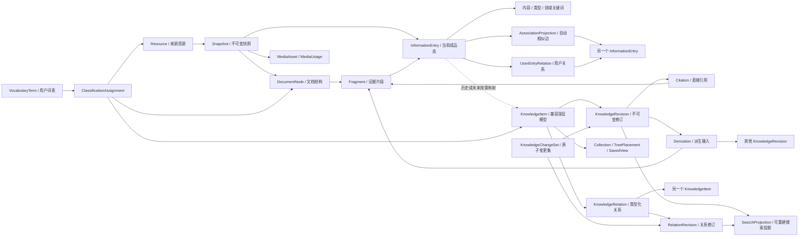

# StruInfo 知识核心架构

- 状态：M1M 单机生产边界与 M2-P5A–D 生产收口已完成
- 最近更新：2026-09-05（维护阶段，不改变已接受架构）
- 当前运行约束：维护基线继续采用私人单用户 `all` 单实例；跨进程共享偏好写入仍遵守 DH-012，见[维护交接](maintenance-handoff.md)
- 相关决策：[ADR 0005](adr/0005-versioned-knowledge-core-and-ai-optional-operations.md)、[ADR 0006](adr/0006-external-configuration-and-personal-data-isolation.md)、[ADR 0007](adr/0007-information-entry-first-document-processing.md)、[ADR 0008](adr/0008-current-entry-state-and-portable-personal-data.md)、[ADR 0009](adr/0009-retire-superseded-m1c-runtime.md)、[ADR 0010](adr/0010-entry-centered-formal-knowledge-graph.md)、[ADR 0011](adr/0011-association-derived-formal-graph-edges.md)、[ADR 0012](adr/0012-provider-neutral-processing-runs-and-proposals.md)、[ADR 0013](adr/0013-openai-entry-tag-proposals.md)、[ADR 0014](adr/0014-openai-entry-association-proposals.md)、[ADR 0015](adr/0015-openai-entry-split-proposals.md)、[ADR 0016](adr/0016-manual-entry-fragment-grouping.md)、[ADR 0017](adr/0017-manual-within-fragment-entry-boundaries.md)、[ADR 0018](adr/0018-local-text-file-import.md)、[ADR 0019](adr/0019-local-html-pdf-import.md)、[ADR 0020](adr/0020-explainable-lexical-entry-search.md)、[ADR 0021](adr/0021-query-association-and-result-comparison.md)、[ADR 0022](adr/0022-evidence-bounded-ai-query-synthesis.md)、[ADR 0023](adr/0023-deterministic-entry-exploration-policy.md)、[ADR 0024](adr/0024-versioned-git-source-subscriptions.md)、[ADR 0025](adr/0025-explainable-entry-preference-profile.md)、[ADR 0026](adr/0026-entry-automation-policy-dry-run.md)、[ADR 0027](adr/0027-recoverable-entry-automation-routing-execution.md)、[ADR 0046](adr/0046-codex-operated-bulk-ingestion.md)
- 当前实现与未完成项：[当前项目状态与实现清单](current-project-state.md)
- 生产身份、恢复与发行回归决策：[ADR 0062](adr/0062-production-release-identity-and-live-deployment-baseline.md)、[ADR 0063](adr/0063-backup-recoverability-and-retention-preview.md)、[ADR 0064](adr/0064-operational-health-capacity-and-alerting.md)、[ADR 0065](adr/0065-production-flow-release-regression.md)
- 当前自动路由与订阅串联决策：[ADR 0028](adr/0028-owner-controlled-entry-automation-routing.md)、[ADR 0029](adr/0029-entry-automation-control-integrity.md)、[ADR 0030](adr/0030-entry-automation-owner-work-queue.md)、[ADR 0031](adr/0031-subscription-deterministic-entry-routing-chain.md)
- 当前确定性推进、拆分编辑与显式批次导入决策：[ADR 0032](adr/0032-deterministic-entry-tag-and-association-actions.md)、[ADR 0033](adr/0033-post-materialization-entry-restructuring.md)、[ADR 0034](adr/0034-pre-split-derived-document-editing.md)、[ADR 0035](adr/0035-versioned-configurable-entry-split-rules.md)、[ADR 0036](adr/0036-explicit-local-multi-file-import-queue.md)
- 当前外部信源决策：[ADR 0037](adr/0037-plugin-compatible-source-acquisition-foundation.md)、[ADR 0038](adr/0038-public-rss-atom-source-subscriptions.md)、[ADR 0039](adr/0039-declarative-json-api-source-subscriptions.md)、[ADR 0040](adr/0040-constrained-web-source-subscriptions.md)、[ADR 0041](adr/0041-installed-source-connector-product-wiring.md)
- 当前正式知识维护决策：[ADR 0042](adr/0042-formal-knowledge-relation-semantics-and-source-review.md)
- 当前检索与性能决策：[ADR 0043](adr/0043-rebuildable-entry-search-index-and-rag.md)、[ADR 0044](adr/0044-evidence-driven-local-performance.md)
- 当前生产运行决策：[ADR 0045](adr/0045-operational-production-baseline.md)

## 1. 核心结论

当前 StruInfo 是一个 Entry-first 的私人单用户工作台，支持本机运行及受认证反向代理保护的私人部署。
活动运行时在 PostgreSQL 中保存来源证据和当前 `InformationEntry`，在外部数据根保存原始
Blob、个人偏好和导出。普通文档的主线是导入 → 拆分 → 标签 → 联系 → 查询。

`Fragment` 是不可变证据锚点，`InformationEntry` 是普通浏览、标注、联系、查询以及
M1E-2 正式图谱的节点。当前 Entry 采用一个成品态和并发版本，不保存每次中间编辑副本。
现有 Curation 和旧 `KnowledgeItem`/`KnowledgeRelation` 表及历史行只为既有数据和个人
数据包兼容保留；ADR 0009 已经删除它们的活动命令、repository adapter、HTTP 和 Web 入口。

当前无 AI 路径已实现：来源/快照/结构证据、本地文件和 Git/RSS/Atom/JSON API/受限网页/已安装连接器采集、确定性 Entry 物化、版本化拆分规则、人工分组、三维标签与两项评分、文档标签、可解释联系、词法查询、联想/比较/探索、精确来源回看、完整个人数据包和正式图谱。M1K 另提供可选的公开 Entry 向量与公开证据 RAG；没有 Provider 时仍使用完整词法主线。ADR 0012 建立不依赖 Provider 的 ProcessingRun/提案信封、读取/取消和真实总览轨道；ADR 0013、0014、0015 分别为用户明确选择的公开 Entry、公开 Entry 对和公开 Snapshot 增加可选 OpenAI tags、association 与 split 提案；三者都必须人工接受并复用现有写边界。ADR 0022 又实现公开查询结果上的显式会话内 AI 综合，但不向模型授予检索或写权限。知识树/集合、复杂事实核验、无确认自动接受、无限制开放网络抓取和面向用户的通用报告生成仍未实现。

## 2. 当前数据类别与目标派生物

| 类别        | 主要内容                                                                                                                                                      | 当前状态                                        |
| ----------- | ------------------------------------------------------------------------------------------------------------------------------------------------------------- | ----------------------------------------------- |
| 证据        | Resource、不可变 Snapshot、Blob、DocumentNode、Fragment 和媒体引用                                                                                            | 活动规范数据                                    |
| 信息条目    | InformationEntry 当前成品态、三维标签、两项评分和 Fragment 输入                                                                                               | 活动规范数据                                    |
| 文档标签    | Snapshot 级当前标签及全文/Entry 覆盖证据                                                                                                                      | 活动规范数据                                    |
| Entry 联系  | 可重建相似度投影和当前人工 override                                                                                                                           | 投影活动；人工控制是规范数据                    |
| 用户偏好    | 快捷标签、提取开关、排除词、URL 规则、确认别名、版本化联系/探索/Entry 偏好规则、Entry 自动处理策略，以及 Git/RSS 信源订阅与成功游标、版本化命名查询与选中身份 | 活动；包体外文件；AutomationPolicy 有所有者控制 |
| 正式知识    | Entry 节点、自动相似边、用户/AI 关系、闭合语义、维护说明、来源核验状态和精确来源；历史 Knowledge 表                                                           | M1J 活动；旧表兼容保留                          |
| 处理任务    | 当前 ProcessingRun、三类提案信封、typed split/tags/association payload，以及自动路由 run header/claims                                                        | 活动；提案与可恢复路由均持久化                  |
| 高级控制    | 自动路由策略/试算/人工接管/运行审计，以及 IntakeDecision、ConflictCase、集合、树、SavedView 和具体下游动作                                                    | 自动路由与命名查询活动；其余历史兼容或未实现    |
| AI/检索派生 | OpenAI split、tags 与 selected-pair association；本地词法/词项、可选公共向量、混合召回、Association 遍历、比较与公开证据 RAG；其他 Provider                   | 三个窄提案、M1F 与 M1K 已实现；其余未实现       |

证据、Entry、正式知识和用户控制数据不能互相覆盖。删除联系投影不会删除 Entry；修改标签不会
改写 Snapshot；模型建议一个关系不能立即使其成为正式知识关系；只有人工接受后才调用现有图谱命令。

## 3. 规范对象关系

下图同时画出当前 Entry 主线、已实现的组合知识图谱，以及兼容保留的旧深度知识模型。`Resource → Snapshot → Fragment → Entry`、Entry 关键词/联系与有界正式图谱都是当前活动路径。



逻辑层次不要求拆成多个 PostgreSQL 服务或图数据库。第一版继续使用一个 PostgreSQL 数据库和一个应用 schema，由模块仓储拥有各自表；跨模块修改只能通过应用用例完成。

### 3.1 Fragment、Entry 与 Knowledge 的边界

Fragment、Entry、自动联系和用户关系不是同一对象的不同名称：

| 对象                    | 回答的问题                                     | 变更规则                                     |
| ----------------------- | ---------------------------------------------- | -------------------------------------------- |
| `Fragment`              | 原始 Snapshot 的哪个精确位置提供了证据？       | 随 Snapshot 不可变                           |
| `InformationEntry`      | 用户要浏览、标注、连接和找回的文档单元是什么？ | 稳定身份加当前成品态；可拆分、合并并保留沿袭 |
| `AssociationProjection` | 哪些 Entry 计算上相似并可直接成为图谱边？      | 可重建分数；人工编辑/block 优先              |
| 用户 Entry 关系         | 用户要怎样命名、定向或补充两个 Entry 的联系？  | 显式命令、当前状态、并发版本和删除/恢复      |

一个 Entry 可以引用一个或多个 Fragment；一个 Fragment 也可以参与多个当前 Entry。
普通编辑只覆盖 Entry 的当前成品态并推进乐观版本令牌，不再保存每次中间输入。正式图谱直接
引用 Entry 稳定身份，因此节点天然保留当前内容、标签、隐私与精确来源，不复制正文。

Entry 的内容、类型和领域关键词服务于文档组织和相似发现。由此产生的 AssociationProjection
可以直接作为 `similarity` 图谱边，但它只陈述“计算上相似”，不能冒充经过人工核验的事实关系。
重建可以更新自动边的分数和解释，不能覆盖用户编辑或持久 block；历史 `KnowledgeItem`/Revision
仍可作为兼容或未来深层语义对象，但不是 M1E-2 页面默认节点。

## 4. 必须分开的六个维度

阶段 0 的人工审核暴露了一个建模错误：内容类型曾被填入处理动作字段。具体人工值已移至仓库外的用户文档；规范模型只记录由此确认的通用规则——内容分类不是处理动作。系统必须分别保存以下维度。

| 维度                    | 示例                                                               | 所有者与用途                         |
| ----------------------- | ------------------------------------------------------------------ | ------------------------------------ |
| `ContentClassification` | 小说、论文、教程、广告、工具介绍、周刊条目                         | 用户工作区词表；回答“它属于什么”     |
| `IntakeAction`          | 完整处理、拆分、压缩、仅保留来源、忽略、待审核                     | 系统工作流动作；回答“现在如何处理”   |
| `KnowledgeKind`         | 新写入：概念、观点、事件、方法、资源、其他；兼容旧实体、框架、作品 | 知识结构类型；回答“形成什么知识”     |
| `EpistemicRole`         | 来源原文所述、从来源整理、根据来源推断、用户补充判断               | 形成方式；回答“这条内容是怎样形成的” |
| `ReviewState`           | 草稿、待审核、已确认、有争议、被驳回、已撤回                       | 生命周期；回答“当前是否被接受”       |
| `OperationOrigin`       | 用户手工、确定性解析、声明式规则、确定性导入、AI 提案、外部客户端  | 审计来源；回答“这次变化由什么产生”   |

当前普通文档工作流只在“标签”页维护有用/有趣评分、确定性内容关键词、类型/领域标签和个人别名；旧 IntakeAction、判断原因与手工联系入口已从活动 UI 和偏好协议删除。既有 Curation 行只作为历史兼容数据保留，不再驱动导入 → 拆分 → 标签 → 联系 → 查询主线。正式 Knowledge 的 KnowledgeKind、EpistemicRole 和 ReviewState 继续属于尚待重新定义 UI 的正式知识协议，不得反向混入普通标签审核。

当前普通标签审核不再复用 Curation 的处理动作。`有用程度` 与 `有趣程度` 直接保存为
当前 `InformationEntry` 的 `usefulness_score` 与 `interest_score`；它们是用户对当前成品条目的
两项独立评价，不隐式生成拆分、压缩、准入或正式知识写入命令。

用户自定义快捷标签保存在数据根 `preferences/` 下按工作区隔离的个人配置中。快捷标签只有在
用户点选并保存 Entry 时才进入当前内容关键词；新增或删除快捷按钮不会重写既有 Entry。无 AI 的
确定性提取只产生可编辑候选：链接目标、路径和文件名默认剥离，链接标题仍可表达语义；用户
可以关闭提取、显式允许 URL 域名或维护精确排除词。提交前按大小写无关身份去重，再应用
用户明确保存的别名映射；系统不会凭字符串包含关系擅自合并不同概念。

000011 在收敛 Entry 当前态时承担一次兼容桥接：与当前 Entry Fragment 输入对应的旧 Curation
`information_density` 和 `current_interest` 评分按 0–4 到 1–5 映射；当前 active 且 assigned 的
分类词投影为内容关键词。若 Entry 已有当前评分或同一规范关键词则保留现值并跳过重复。桥接完成后，
旧 Curation 表仅作为历史数据和个人数据包兼容内容，不再有活动命令、读取端口或普通审核写入。

普通 Entry、自动相似边和用户关系保持显式来源。M1E-2 已按 ADR 0011 接通正式知识图谱读取和编辑；标签审核仍不会创建用户语义关系，也不会恢复旧处理意图、判断原因或手工联系。ADR 0009
已删除 M1C Curation、Knowledge 和 Retrieval 的活动纯逻辑、repository adapter、HTTP 与 Web
入口；既有迁移、历史表、旧行和个人数据包分区继续保留，代码清理不等于用户数据删除。

`EpistemicRole`、`KnowledgeItem`、`KnowledgeRevision` 和旧类型化关系仍是历史与可选深层
语义模型的词汇，但不再是 M1E-2 图谱页面的默认编辑对象。新页面通过现有 Association 投影与新的最小用户编辑边界维护 Entry 间图谱；不得悄悄恢复
已删除的高级编辑器。

## 5. 历史与可选深层 Knowledge 模型（当前运行时未启用）

### 5.1 稳定身份与不可变修订

本节记录兼容保留及远期深层语义模型，不是当前 API 清单，也不是 M1E-2 首个切片。`KnowledgeItem` 只承担稳定身份、工作区边界和当前修订指针。标题、正文、类型、时间和状态等可变化语义进入 `KnowledgeRevision`.

每次有效编辑创建新修订：

- 旧修订不原地覆盖；
- 当前修订指针与变更集在同一事务更新；
- 引用绑定具体修订，语义变化后必须重新核验；
- 撤回使用补偿修订和 `supersedes`/`reverted_by` 关系；
- 隐私删除与知识撤回是两种不同操作，前者按保留策略撤销访问并最终清理字节。

隐私文档使用规范数据中的显式、可查询事实，而不是前端临时标签。`Resource.is_private`
标记整个来源文档；`KnowledgeRevision.is_private` 与
`RelationRevision.is_private` 固化该修订的隐私传播结果。首版传播是单调的：来自隐私
Fragment、隐私历史修订或既有隐私修订的知识保持隐私；关系使用隐私证据或任一当前端点
为隐私时也保持隐私。解除隐私必须是未来独立、可审计的显式命令，普通编辑不能顺带完成。

### 5.2 类型与可扩展字段

核心表保存稳定且经常查询的字段，例如工作区、类型、状态、语言、时间范围、当前修订、归属者和版本。低频且随知识类型变化的字段可以进入带 schema 版本的受验证 `jsonb` payload，但不能把整个数据库退化为无约束 EAV 或任意 JSON 文档库。

用户分类、主题、领域和自定义标签通过 `VocabularyTerm` 与 `ClassificationAssignment` 建模。词表记录稳定 key、显示名、父词条、版本、适用对象和退役状态；重命名显示名不改变历史引用。首个证据目标实现由 [`C-SLICE-A-CURATION-r3`](manual-curation-contract.md) 冻结并归 `curation` 模块所有；未来对正式 `KnowledgeItem` 的分类只复用其词表读取边界，由知识核心命令拥有指派，不能让两个模块共同写同一行。

### 5.3 别名、同一性与合并

`KnowledgeAlias` 保存名称、语言、规范化形式和适用范围。名称相同只产生同一性候选，不自动合并。

在正式 `KnowledgeAlias` 投影实现前，M1C 使用包体外工作区偏好保存轻量词表整理规则：
大小写身份直接复用现有词条；中英文等价写法由用户确认为别名；包含或语义相近的词只作为
候选，由用户选择翻译提示、相关提示或合并。显式合并会把当前分类迁移到保留词条并退役
来源词条，历史修订不删除。该偏好还可把任一用户词条映射到通用 `KnowledgeKind`，例如
`work`；真实标签名称不进入源码。词表提示不是正式 `KnowledgeRelation`，后续投影可以从
这些外部规则和已确认领域事实重建。

合并两个知识项属于高影响命令：

- 选择保留的稳定 ID；
- 保留被合并 ID 的重定向和历史；
- 显式迁移或保留关系、分类和树位置；
- 生成可审核的变更集；
- 不删除旧证据或修订。

### 5.4 关系

`KnowledgeRelation` 只保存稳定关系身份、工作区和当前修订指针；`RelationRevision` 保存某次关系陈述的主体、关系类型、客体、方向、限定条件、认知角色、审核状态、有效时间和依据。改变任一端点或谓词通常创建新关系；只有在纠错并保留同一业务身份确有价值时才修订原关系。

关系必须：

- 有方向和明确类型；
- 可以有多个相互独立或冲突的来源；
- 可以被修订、撤回或标记有争议；
- 支持条件、范围和时间，而不是把所有关系压成永久事实；
- 与 `TreePlacement` 分离；树的父子关系不会自动创建 `is_a` 或 `part_of`。

关系类型可以由版本化词表扩展，但具有权限或算法语义的系统关系必须由迁移和代码审查引入，不能通过个人配置改变安全行为。

### 5.5 引用与派生

`Citation` 表示某个知识或关系修订直接依赖哪个 `Fragment`。`Derivation` 表示总结、推断、组合或规则结果由哪些片段、修订、处理运行或规则版本产生。

直接引用与派生不可互换：AI 总结可以由多个来源派生，但不能因此声称每个句子都是某一来源原话。

### 5.6 组合与重组

重组知识不应复制原正文：

- `Collection` 保存有序或无序的知识引用；
- `TreePlacement` 把同一知识放到多个导航位置；
- 目标 `SavedView` 保存查询条件、排序和展示配置；当前 ADR 0067 仅实现外部 `entrySavedQueries` v1：最多 20 项既有条件与可选选中 Entry 身份，使用集合 revision，重新打开后当前读取与隐私当次选择。没有新表、结果快照或旧 Knowledge 运行时；
- `Framework` 类型的知识修订可以通过成员关系组合多个概念、方法和断言；
- 新的综合文章或说明是一个新修订，并通过 `Derivation` 指向所使用的知识和证据。

因此，“拆分”产生较小的正式单元，“连接”产生类型化关系，“重组”产生引用既有单元的集合、框架或派生修订；三者都不会破坏原始来源。

### 5.7 关系表族

第一版按模块组织普通关系表，而不是建立一个万能节点表：

| 表族                 | 代表对象                                                                            | 关键约束                                                      |
| -------------------- | ----------------------------------------------------------------------------------- | ------------------------------------------------------------- |
| `evidence`           | Resource、Snapshot、DocumentNode、Fragment、MediaAsset/Usage                        | Snapshot 和证据定位不可变；Blob 以内容哈希校验                |
| `vocabulary`         | VocabularyTerm、VocabularyRevision、ClassificationAssignment                        | 词条 key 稳定；显示名和层级可版本化；赋值保留历史             |
| `knowledge identity` | KnowledgeItem、KnowledgeAlias、KnowledgeRelation                                    | 稳定 ID、工作区范围、当前修订指针和合并重定向                 |
| `knowledge history`  | KnowledgeRevision、RelationRevision                                                 | 追加式修订；当前指针由同一事务推进                            |
| `provenance`         | RevisionCitation、RelationCitation、DerivationInput                                 | 使用真实外键指向精确修订和 Fragment，不用无法约束的多态字符串 |
| `change control`     | KnowledgeChangeSet、ChangeOperation、Candidate、ConflictCase                        | 幂等键、预期版本、授权依据、来源和审计一起提交                |
| `composition`        | Collection、CollectionMember、TreePlacement、SavedView                              | 只引用稳定知识 ID；删除视图不删除知识或证据                   |
| `retrieval`          | SearchProjection、TermPosting、RelationNeighborhoodProjection、可选 EmbeddingRecord | 记录输入修订和算法/模型版本，可整体删除重建                   |

所有业务主键都和 `workspace_id` 一起进入唯一约束、外键解析和查询条件。跨表“任意对象”引用优先拆成带真实外键的专用连接表；只有公共协议明确需要并能在应用层完整验证时，才使用带对象类型的通用引用。

## 6. 图谱编辑使用一个明确命令边界

可见 AssociationProjection 通过读取边界直接成为自动 `similarity` 图谱边，不需要写入命令或
逐条确认。任何用户改变仍必须使用窄命令，而不是让页面直接修改表。第一版只需要：

- 编辑自动边的标签或方向，形成优先于投影展示的用户解释；
- 屏蔽/删除或恢复自动边；
- 在两个现有 Entry 之间创建、修改或删除用户关系；
- 读取一个中心 Entry 的有界组合邻域。

每个写命令都需要工作区、两个 Entry 端点、预期版本、操作来源和幂等身份；纯用户关系还需要
稳定关系身份。知识模块核验端点、隐私、方向和并发版本后原子提交。自动边继续使用现有投影和
override，不复制为第二套相似度表；重建只更新底层分数与解释，不能覆盖用户编辑或 block。

创建 KnowledgeItem/Revision、别名、集合、树、ConflictCase 或完整 KnowledgeChangeSet 属于历史
兼容或未来深层语义能力，不是 M1E-2 首个切片。未来重新引入时仍必须经过新的公开命令和单独验收。

调用者可以是：

1. 网页中的用户手工操作；
2. Markdown、CSV、JSON 等确定性导入器；
3. 用户启用的声明式规则；
4. AI/OCR 适配器生成的提案；Embedding 适配器只构建检索投影；
5. 将来经授权的外部项目。

来源不同不会产生第二套数据库写入逻辑。AI 没有特殊的“直接入库通道”。

## 7. 完全不依赖 AI 的操作模式

| 能力     | 当前无 AI 行为                                                                                                                                                                                        | 尚未实现的增强                                        |
| -------- | ----------------------------------------------------------------------------------------------------------------------------------------------------------------------------------------------------- | ----------------------------------------------------- |
| 摄取     | 手工 Markdown、固定 Git Markdown、单份或最多 20 份显式批次本地 Markdown/文本/HTML/带文字层 PDF、精确 Git Markdown、公开 RSS/Atom、声明式 JSON API、受限同源网页与已安装连接器检查、完整证据与隐私标记 | Office/OCR、目录扫描/监视、开放网页发现与插件安装市场 |
| 拆分     | 拆分前唯一全文草稿与派生 Snapshot；CommonMark/周刊 profile；版本化本地 section/相邻短段合并规则；既有 Fragment/标量边界人工分组；物化后人工结构迁移；可选公开 Snapshot OpenAI 提案                    | 来源重排、任意脚本/自定义解析器、私密外发             |
| 标签     | 三维标签、五档有用/有趣、确定性候选、外部快捷标签/排除/别名；可选 OpenAI tags                                                                                                                         | 自动语义合并和无确认接受                              |
| 联系     | 确定性相似边、分项解释、增强/削弱/屏蔽/恢复；正式图谱提供八类关系语义、维护说明、来源核验和用户关系                                                                                                   | 复杂本体、自动事实核查                                |
| 查询     | 标题/正文/标签的精确、包含和近似词法匹配；可重建 Unicode 词项、可选公共向量与词法/语义/混合召回；结构、来源、时间、隐私、一至两跳联系、游标、来源和公开证据 RAG                                       | 字典分词、私密向量/RAG、在线 Web 混合查询             |
| 传输     | 66 表、引用 Blob 字节、偏好、Entry v5、Association v5 与 Processing v10；空目标恢复                                                                                                                   | 跨工作区克隆、非空合并、灾难恢复                      |
| 正式知识 | 最高匹配 Entry 中心、有界图谱/列表、边来源、闭合语义、维护说明、来源核验、用户编辑、AI 联系提案和双端精确来源                                                                                         | 树/集合/时间线、复杂本体与自动事实核查                |

没有配置 AI Provider 时，系统显示“AI 未启用”，导入、确定性/人工拆分、标签、联系和查询仍可使用。当前完整配置 OpenAI 后分别发布 `ai_split`、`ai_tags`、`ai_associations` 与 `ai_query_synthesis`；每个 capability 只开启自己的窄界面。
`processing_runs` 只证明持久任务读取/取消和提案信封可用；每个 `ai_*` capability 只证明对应窄边界可用，不能被解释为自动维护、语义检索或泛化 AI 已经启用。

可信样本类型学习的 Profile、工作包、影子模型和激活保护属于冻结的实验性边界，不属于当前可用的自动泛化标注能力。其真实泛化质量尚未被所有者接受；在重新排队的 `M2-P4R` 明确恢复前，当前架构不激活该模型，也不让它参与 Entry 正式写入。

工作区 Bundle v1 通过五个闭合分区携带当前数据库状态、Blob 字节和偏好。它不是任意 JSON
知识存储，也不携带运行配置或秘密。

## 8. 搜索组织

当前活动搜索以 InformationEntry 为主结果单元，并为完整隐私文档保留独立结果通道：

1. 对查询文本执行确定性规范化，并按显式 `exact`、`substring` 或 `fuzzy` 模式匹配；
2. 在用户选择的标题、正文和标签范围内匹配；标签覆盖内容、类型和领域关键词；近似模式返回有界词法分，不代表语义相同；
3. 支持内容关键词、来源、Snapshot、类型/自定义类型、领域/自定义领域、主副领域、整篇/拆分和发布时间/采集时间过滤；
4. 可从一个 Entry 沿未屏蔽联系遍历一或两跳，并返回分数和路径；
5. 隐私范围在计数、候选、遍历、排序和分页之前应用；
6. Entry 结果使用绑定查询语义的游标，返回匹配原因、过滤原因和精确 Fragment 来源；
7. 只有当次显式包含隐私时，服务端才从外部 Blob 按需匹配完整私密正文，并在 Entry 分页之外返回独立文档结果。
8. 用户可另行以当前可见 Entry 为锚点，从直接 Association 生成页外探索候选；该结果不进入普通排序、计数、分页或游标。

当前已有可重建的 Unicode 词项索引和可选公开 Entry Embedding。公开 exact/substring 查询已有 SQL 候选缩小与选择性 Entry 读取，但没有完整查询语义的 SQL 下推、`pg_trgm`、字典型中文分词、独立向量数据库/`pgvector`、私密向量或在线搜索。M1F-1 的近似模式仍是内存中的可解释词法窗口评分；M1F-3 只综合既有公开结果，不是新的召回方式。完整隐私文档只在显式隐私范围下进入独立结果通道，正文不复制到普通 Entry 索引，也不发送给向量 Provider。

M1E-2 知识页复用确定性 Entry 匹配选择最高结果为中心，再读取有界正式邻域；它不替代本节的完整 Query 结果。ADR 0022 的 AI 综合只消费当前公开结果，不改变本节的隐私或证据身份。ADR 0023 的探索也只是一个明确操作后的独立直接邻域读模型；它不学习偏好、不制造新边，也不改变搜索召回。ADR 0043 已加入版本化词项投影、可选公共向量召回和公开证据 RAG；所有派生索引仍必须可从规范 Entry 当前态重建。别名/字典分词、私密向量和在线检索只有在后续产品边界接受后加入。

## 9. 数据库特性与不变量

第一版继续使用 PostgreSQL 18、普通关系表和邻接关系，不增加图数据库、向量数据库或独立搜索服务。

### 9.1 当前活动不变量

- 每条个人业务记录显式携带 `workspace_id`，并进入查询、唯一约束和幂等范围；
- Resource/Snapshot/Fragment 是证据身份，Snapshot 及其结构不可原地改写；
- 当前 Entry、Document 标签和联系控制使用期望版本，迟到写入不能覆盖新状态；
- Entry 联系投影可以重建；版本化内容/类型/领域权重与阈值保存在外部个人配置，策略重建不能静默覆盖人工增强/削弱/屏蔽/恢复；
- 版本化探索策略独立于联系权重和未来偏好画像；默认关闭，生成候选只读且不能改变普通搜索或任何规范数据；
- 导入和写入保持参数化 SQL、工作区隔离、事务和明确失败；
- Blob 使用内容寻址，个人数据包同时携带数据库状态、引用字节和偏好；
- 隐私先于读取计数、联系候选、遍历、排序和分页，披露需要当前操作显式选择；
- ProcessingRun 使用闭合状态转换和期望版本；错误只保存稳定 code，提案只引用同工作区 typed targets 与精确 Fragment；
- 所有 AI 字段和服务都可以缺席，当前无 AI 主线仍完整运行。

### 9.2 M1E-2 图谱边不变量

- 所有边只引用同一工作区中的两个现有 Entry 稳定身份；
- 可见 AssociationProjection 无需人工确认即可成为对称 `similarity` 边；
- 每条边必须标明自动计算、用户编辑或用户创建来源；自动边还显示分数和解释；
- 用户编辑、屏蔽/删除和恢复必须经过明确命令，并优先于后续投影重建；
- 用户创建关系的标签、方向、当前状态和并发版本是规范工作区数据；
- 隐私在中心搜索和关系遍历前应用，隐藏端点的边也隐藏；
- 节点来源沿 Entry 的精确 Fragment 输入返回，不复制或猜测 provenance；
- 历史 Knowledge 表不会自动迁移成 Entry 图谱，也不授权恢复旧 Knowledge API。

## 10. 工程代码、运行配置和个人数据隔离

```text
应用安装/镜像
  ├─ 程序代码、迁移、契约、配置 schema、无真实值示例
  └─ 不含个人知识、偏好、词表、规则、凭据、快照、导出或备份

外部运行配置
  └─ 数据库地址、监听地址、外部数据根、工作区身份和秘密引用

PostgreSQL 当前工作区状态
  ├─ Resource / Snapshot / DocumentNode / Fragment
  ├─ InformationEntry / Document 标签 / Entry 联系
  └─ 只为兼容保留的历史 Curation / Knowledge 行

外部 Blob/Data Root
  ├─ 原始/规范化 Blob、图片和附件
  ├─ preferences/ 下的个人偏好
  └─ exports/ 与备份；不位于源码仓库或安装目录

外部秘密存储
  └─ 数据库及未来 AI/Webhook 凭据；业务记录只保存允许的引用
```

个人分类词、Entry/正式知识正文、偏好评分、探索策略、信源订阅、保存查询、UI 布局和用户提示词都属于用户资源。它们不得作为 TypeScript 常量、真实 fixture、迁移 seed、前端 mock、构建资源或容器镜像内容出现。当前偏好是外部文件；未来新增数据也必须先选择明确的外部文件或数据库边界。

代码可以固定数据库协议、状态机、权限规则、字段校验和合成测试数据。仓库可以保存没有真实值的配置 schema 与示例，但实际运行配置、个人配置和数据必须从包体外加载。

应用模块只依赖稳定协议和可替换端口，不直接依赖个人文件：

```text
同一应用构建
  └─ composition / typed ports
       ├─ 包体外运行配置与秘密引用 ──> PostgreSQL / Blob adapters
       ├─ 稳定 workspace_id ─────────> 工作区范围的 repository
       └─ 版本化个人数据包 ──────────> 校验后的导入 / 导出命令
```

更换个人资料集的正式方式是切换稳定工作区，或把外部个人数据包验证并恢复到空工作区，而不是替换源码目录中的“记忆模块”。首版可以通过受控重启或关闭并重新打开 composition root 完成切换；失败不能留下数据库来自 A、Blob 根来自 B 的混合状态。个人数据包是可移植载体，不是直接在线存储或可执行插件。

证据 Resource 的 `source_key` 是 adapter-owned、deterministic、portable opaque identity。
盘符路径、UNC/rooted path、POSIX 绝对路径、Windows 反斜杠形式或 traversal segment 不得成为持久身份。
本地文件适配器应使用上传登记 ID、适配器记录 ID、内容身份或其他可移植 key。
若未来必须保留原始本地路径，应定义独立的私有 typed locator 及导出和日志脱敏规则，不能把路径重载到 `source_key`。

Windows 本地运行和 Linux 部署都必须使用源码/安装目录之外的数据根。启动时规范化真实路径并拒绝把个人数据根、Blob 根、导出或备份目录放在仓库、应用安装目录或只读包体内部。容器部署使用外部卷或对象存储，不能把数据写入镜像层。

候选应用包通过[制品边界](application-artifact-boundary.md)实际枚举并生成哈希清单；被 Git 忽略不代表可以进入包体。容器镜像仍在独立准入门中验证，当前结果不能被描述为镜像或发布许可已经完成。

## 11. 当前实现清单与下一顺序

### 11.1 当前活动实现

1. **运行与隔离**：包体外配置固定工作区、PostgreSQL、Blob 根、偏好和导出目录；
2. **导入**：手工 Markdown、固定 Git Markdown、单份或显式多文件批次的本地 Markdown/文本/HTML/PDF，或精确公开 GitHub Markdown、RSS/Atom、声明式 JSON API、受限同源网页和已安装受信任连接器的变化内容，逐份原子写入证据元数据、内容寻址 Blob 和结构；M1I-1 提供内建/插件共享的有界连接器结果与 `remote_document` 幂等入库底座，M1I-2 至 M1I-5 只扩展 reader 与配置入口，不把持久化或后续处理权交给连接器；
3. **拆分**：用户选择 Snapshot，可先保存一份当前全文草稿并显式确认成不可变派生 Snapshot，再以 CommonMark section、人工 Fragment/标量区间分组或已接受 AI 提案幂等物化 Entry；
4. **标签**：保存 Entry 当前正文、三维标签、两项评分和外部个人词汇偏好；
5. **文档标签**：按全文出现与 Entry 覆盖确定性聚合，或由用户保存当前标签；
6. **联系**：重建分项可解释的候选投影，并保存逐对人工控制；
7. **查询**：组合文本、结构、来源、时间、隐私和一至两跳联系，稳定分页并返回精确证据；
8. **探索**：在用户明确选择的当前结果之后，按外部策略从可见直接联系生成有界、可解释的页外候选；
9. **传输**：五分区个人数据包携带 66 张当前工作区表、引用 Blob 字节、含联系/探索/Entry 偏好和 AutomationPolicy 及信源订阅/游标/串联开关的偏好、Entry v5 当前结构/精确区间/全文工作副本、Association v5 图谱语义/说明/来源核验版本元数据和 Processing v10 状态；
10. **处理任务**：Provider-neutral ProcessingRun/提案信封持久化，API 读取/取消；订阅检查写入真实 import 运行；可选 OpenAI split、tags 与 selected-pair association 启动、接受/拒绝；M1G-4B 以 typed claims 持久化自动路由并在失败时补偿，M1G-4C/D 提供显式所有者控制和审计，M1G-5A 将成功 claim 投影为独立所有者工作队列，M1H-1 只对显式授权的推进 claim 执行本地确定性标签和可替换联系投影；M2-P0A 以 batch/item 控制表和 ProcessingRun 尝试支持 Codex 操作的逐 Snapshot 可恢复物化，M2-P0B 在同一成功批次上执行确定性标签、typed 异常和只触及本批 Entry 的增量联系，M2-P0C 再提供当前/过期异常汇总、稳定抽样与精确数量保护的当前裁决状态，M2-P0E/P0F 通过外部稳定工作包批量阅读并以 closed result 幂等回写疑难项，M2-P0G 按阶段持久状态提供有限窗口统一推进；总览真实轨道；
11. **产品壳**：总览、导入、拆分、标签、联系、查询、正式知识七个活动页面；
12. **必要基础**：迁移、健康检查、日志、生命周期、非重叠订阅调度、共享队列基础、测试、构建与制品审计。

### 11.2 兼容保留

- `000003`、`000004`、`000006`、`000007` 等历史迁移及其数据表；
- 旧个人数据包分区和历史行；
- 窄迁移/兼容测试与不参与当前质量门的 PostgreSQL TM2 档案；
- `m1c_*` 命名残留，只承载当前本地接口或兼容传输，不代表旧工作流仍活动。

### 11.3 下一实施顺序

M1E-2 与直接使用增量已经完成。ADR 0012 的 M1E-3A 已接通中性任务边界；ADR 0013/0014/0015 的 M1E-3B/C/D 已选择同一 OpenAI Responses API，分别实现公开 Entry 标签、selected-pair 联系和公开 Snapshot 拆分提案，并把接受转换为既有 Entry revision、graph edge command 或 Entry materialization。ADR 0016 的 M1E-4A 补齐既有 Fragment 边界上的本地人工分组，ADR 0017 的 M1E-4B 进一步允许 Fragment 内 Unicode 标量边界，并让确定性、人工和 AI 接受共用唯一空 Snapshot 原子边界。ADR 0018/0019 的 M1E-5A/5B 把单份本地 Markdown、文本、HTML 和 PDF 接入同一 Evidence 与 Split 主线；ADR 0020 的 M1F-1 补齐精确、包含和近似本地词法查询，ADR 0021 的 M1F-2 让同一 Query 直接开启 Association 遍历并比较最多两条结果，ADR 0022 的 M1F-3 接通会话内公开证据综合，ADR 0023 的 M1G-1 接通独立本地探索策略，ADR 0024 的 M1G-2 接通精确公开 GitHub Markdown 单文件订阅，ADR 0025–0029 完成可解释偏好与可恢复路由控制，ADR 0030/0031 又完成所有者工作队列及默认关闭的订阅后确定性物化/分流，ADR 0032–0036 补齐显式推进动作、物化后结构纠错、拆分前派生全文编辑、版本化本地拆分规则和显式多文件导入会话队列。ADR 0037–0041 的 M1I-1A/B 至 M1I-5 已完成连接器/远程文档底座、RSS/Atom、声明式 JSON API、受限同源网页和已安装连接器产品接线。ADR 0042 的 M1J 已在同一 Entry 图谱中补齐闭合关系语义、维护说明、来源核验状态、双端来源操作和 Association v4 兼容传输。ADR 0043 的 M1K 又完成可重建词项/向量索引、三种 Query、召回评估和公开证据 RAG。ADR 0044 的 M1L 已完成可重复合成性能基准、单次关联读取索引和搜索请求重复加载优化。ADR 0045 的 M1M 已完成单机容器、维护和恢复运行边界。ADR 0046–0049 的 M2-P0A–P0D 已完成批量物化、确定性 enrichment、异常复核与 disposable PostgreSQL 15,000 Entry 工程证据；ADR 0050–0058 又完成外部 Codex 批次审阅、closed 幂等回写、有限窗口统一推进、真实规模收口和确定性分类扩展。ADR 0059–0061 的类型学习工程已冻结为实验基线并重新排入 M2-P4R。ADR 0062–0065 完成 M2-P5A–D：固定发行/开发/运行身份，补齐备份盘点与只读校验，增加运行健康/容量/备份年龄告警，并把 disposable PostgreSQL 18 回归贯穿到搜索与知识读取。2026-09-05 的代码盘点和后续开发顺序见[路线图](roadmap.md#下一开发顺序2026-09-05-代码核对)：工作树候选收口和 ADR 0066 增量索引维护已完成，ADR 0067 已完成外部命名查询与阅读位置；ADR 0068 已完成版本绑定的关系来源复核，ADR 0069 已完成所选 Entry 的引用式 Markdown 导出；未安装的连接器不得在 UI 中伪装为可用。

## 12. 当前验收与未来验收

### 12.1 当前可运行基线

当前验收只覆盖实际存在的 Entry-first 产品边界：

- 文档 Entry 可以在不创建 KnowledgeItem 的情况下设置三类关键词、五档评价、建立可解释联系并被搜索；
- 导入、确定性/人工拆分、标签、联系和查询只调用当前 Evidence、Entry、Document 标签与 Entry 联系边界，不依赖已退役的 Curation/Knowledge 运行时；
- Entry 与 Fragment 保持不同身份，并能从查询结果精确返回来源证据；
- 正式知识页通过独立图谱读写边界组合现有联系和用户关系，不恢复旧 Knowledge API，也不把“联系”页的候选调参冒充成正式图谱编辑；
- 没有 AI 配置时，当前五步主线、个人数据导入导出和恢复仍可使用；
- 个人资料、偏好、原始 Blob、导出和备份保持在仓库与应用包体之外。

### 12.2 M1E-2 正式知识边界

ADR 0010/0011 接受的页面对象、检索语义和边来源已由 M1E-2 实现并纳入聚焦验收：

- 搜索最高匹配 Entry 并将其作为图谱中心，同时允许改选中心；
- 自动相似联系无需晋升即可作为带来源、分数和解释的 `similarity` 边显示；
- 用户可编辑、屏蔽/删除、恢复自动边，也可创建和删除纯用户关系；
- 只读取有界邻域，并能显式换中心或逐步展开；
- Association 重建可更新自动分数，但不得覆盖用户编辑或 block；
- 图谱和等价列表/树返回相同核心节点与边，并能打开精确 Fragment 来源；
- 公开、包含隐私和只看隐私范围在中心搜索与遍历前生效；
- 个人数据包往返用户关系、编辑和 block，投影本身仍可重建。

这些能力以当前图谱纯逻辑、迁移、repository、HTTP service、客户端、Bundle 和 Web 验证为依据；保留的历史 Knowledge 表仍不能单独证明任何活动能力。

### 12.3 M1E-3A 任务与提案边界

- ProcessingRun 稳定身份、来源、阶段、进度、隐私范围、状态、错误 code 和版本持久化；
- queued/running 任务可用可见版本取消，终态不可重开；
- split/tags/association 提案信封只保存 typed targets、摘要和精确 Fragment 输入；
- 总览仅展示真实记录；无记录和无 Provider 是正常空状态；
- 个人数据包往返三张 Processing 表，旧包缺失该分区时恢复为空；
- M1E-3A 自身没有公开启动、Provider 调用、闭合提案 payload 或接受入口；模型始终不能直接写 Entry/图谱。

### 12.4 M1E-3B OpenAI tags 边界

- OpenAI Responses API 适配器只接收一个公开 Entry 的标题路径与正文，并要求闭合 JSON Schema 输出；
- 私密 Entry 在 Provider 调用前拒绝，Blob、API key、其他 Entry、偏好和数据库连接不会进入请求；
- API/标签页提供按 Entry 列表、显式启动、接受和拒绝，通用 `ai` capability 不会被开启；
- 接受通过 `prepareAiEntryTagRevision` 和现有 `reviseEntry`，保留正文、评分、隐私、Fragment 输入与乐观并发；
- Processing Bundle v2 携带三张 typed proposal 表，旧 v1 升级为空状态；
- 没有 Provider 配置时 `ai_tags` 缺席，完整无 AI 主线和启动不受影响。

### 12.5 M1E-3C OpenAI association 边界

- 只有用户明确选中的两个公开 Entry 会进入 Provider 请求；
- 任一隐私端点在 fetch 前拒绝，其他 Entry、Blob、偏好和数据库连接不进入请求；
- typed payload 冻结两个 Entry 修订、override 修订、模型、Prompt 版本、关系名和方向；
- API/正式知识页提供列表、显式启动、接受和拒绝，并显示 `AI 生成 · 待审核`；
- 接受复用现有 graph edge command/CAS，图谱结果标记 `ai_assisted`，后续人工编辑仍是最终权威；
- Processing Bundle v3 携带第七张 Processing 表，旧 v1/v2 升级为空状态；
- 无 Provider 配置时 `ai_associations` 缺席，人工图谱、确定性联系与所有无 AI 主线不受影响。

### 12.6 M1E-3D OpenAI split 边界

- 只有用户明确选择的公开 Snapshot 会进入 split 提案链；私密 Snapshot 在 Blob 读取与 fetch 前拒绝；
- Provider 只接收结构顺序、ordinal 和 section Fragment 正文，不接收 workspace/Snapshot/Fragment ID、偏好或数据库信息；
- closed payload 必须以连续、不重叠、完整覆盖的 Fragment 分组表示，不允许模型改写原文；
- API/拆分页提供列表、显式启动、逐组精确 Fragment 审阅、接受和拒绝，并清楚标明外部 AI 来源；
- 接受从本地 Fragment 重建 Entry 标题与正文，复用 workspace lock 和既有空 Snapshot 物化边界；拒绝不创建 Entry；
- Processing Bundle v4 携带三张 split payload 表，旧 v1/v2/v3 升级为空状态；
- 无 Provider 配置时 `ai_split` 缺席，确定性 section 物化和其余无 AI 主线不受影响。

### 12.7 M1E-4A 人工 Fragment 分组边界

- 只处理用户当前选择且尚无 Entry 的 Snapshot；隐私 Snapshot 需要当次显式本地范围；
- 初始一 Fragment 一组，用户可以合并相邻组、在任一既有 Fragment 前重新拆开、重置、全部合并并编辑标题；
- 扁平分组必须按来源顺序恰好覆盖第一结构的全部 section Fragment，不能遗漏、重复、重排或提交正文；
- 服务端从本地 Fragment 重建正文并记录 `struinfo.entry-split.manual-group.v1`，Snapshot/Fragment 证据保持不可变；
- 确定性、人工和 AI 接受共享 workspace lock 下的空 Snapshot 原子赢家，后到路径不会叠加或覆盖；
- M1E-4A 本身不新增迁移、依赖、Bundle 分区或个人配置；当时尚未覆盖的 Fragment 内范围由 ADR 0017 后继实现。

### 12.8 M1E-4B Fragment 内人工边界

- 人工输入以不可变 Fragment 正文的半开 Unicode 标量区间表示，完整覆盖全部 section Fragment；
- 区间必须连续、无缺口、无重叠且保持来源顺序；服务端只接收标题、Fragment ID 和区间并重建正文；
- 前向迁移 `000017` 的可选一对一子表保存精确范围；无范围行继续表示完整 Fragment；
- Entry Bundle v3 携带第八张范围表，v1/v2 升级为空范围状态；M1H-2 的 Entry v4 在同八张表中加入当前结构事实并把 v1–v3 升级为 current；M1H-3 的 Entry v5 增加第九张全文工作副本表并把 v1–v4 升级为空工作副本；历史上 M1H-3 时个人数据包为 61 表，M2-P0A Processing v8 增加两张批量控制表，M2-P0B Processing v9 再增加两张 enrichment 表，M2-P0C Processing v10 增加一张当前裁决表，当前共 66 表；
- Split 工作台只读显示每个来源片段，支持鼠标或键盘放置光标并显式执行“在光标处分开”；
- 继续复用空 Snapshot 原子赢家和显式隐私范围，不改证据、不引入 Provider/依赖，也不迁移已有 Entry 结构。

### 12.9 M1E-5A 本地文本文件导入边界

- 只读取用户当次明确选择或拖入的一份 `.md`、`.markdown`、`.txt`，不扫描目录，不发送机器路径；
- 浏览器与服务端共同保持 1 MiB、严格 UTF-8、非空/NUL 和 canonical Base64 边界；`uploaded_file` 与 Base64 必须同时出现；
- 无前置文字时原始字节保持不变；有前置文字时形成明确的组合 Snapshot，不能冒充原文件副本；
- 基础文件名与 SHA-256 构成默认 portable source key，用户可用显式别名替换；
- 导入继续复用现有外部 Blob、不可变 Snapshot/Fragment、隐私传播和幂等命令；成功后才进入现有 Split 队列；
- 本切片不新增迁移、依赖、仓库内用户文件或第二套存储，也不声称支持 PDF/DOCX/OCR、多文件或自动采集；后续 M1E-5B 增加 HTML/PDF 文字层，M1H-5 增加显式最多 20 文件会话队列，DOCX/OCR 和自动采集仍未实现。

### 12.10 M1F-1 可解释本地词法查询边界

- 非空查询显式选择 `exact`、`substring` 或 `fuzzy`，以及标题、正文、标签中的至少一项；默认保持全部字段的 substring 行为；
- 全部模式复用既有双 NFC + ASCII 小写 search key；近似模式只比较查询长度附近的 Unicode 字符与双字符窗口，短查询不宽泛近似；
- 结果返回整数词法分，排序和 cursor v2 绑定模式、规范字段集合与分数；界面不得把它显示成概率、可靠性或语义等价；
- 隐私在匹配、评分、计数、关联遍历、排序和分页前生效；完整隐私文档只在当次明确授权后以相同字段语义读取外部 Blob；
- 本切片不新增迁移、依赖、索引、Provider、搜索服务或个人数据。中文分词、自动翻译、语义/向量检索、RAG 与 query pushdown 仍需独立证据和决策。

### 12.11 M1F-2 查询联想与结果比较边界

- Association 仍是现有可重建投影加持久化用户 override；Query 只把当前可见 Entry 设为既有一至两跳过滤起点，不创建边或改变联系策略；
- 比较状态最多保存同一语义查询的两个已返回结果，可跨 cursor 页面使用，但查询字段、过滤、Association 或隐私范围变化后立即不可见；
- 比较只并列展示产品事实和精确证据，不合成分数、不判断优劣、不推断关系，也不进入外部偏好、数据库或个人数据包；
- 本切片是 Query-owned 前端能力，复用现有搜索响应，不新增 HTTP、迁移、依赖、Provider、向量或真实资料。

### 12.12 M1F-3 证据约束 AI 综合边界（已实现）

- 普通 Query 仍先独立完成筛选、Association 遍历、隐私、排序和分页；AI 只能在用户显式操作后综合同一公开语义查询的前 8 条结果；
- 证据包只含请求内句柄、标题、有界正文摘录和三维公开标签；不含稳定数据库身份、Blob、来源 URL、偏好或隐私内容；
- 闭合输出必须给出答案、证据状态、claim 到请求内证据的引用和局限；应用只按本地映射打开 Entry 修订与精确来源；
- `includePrivate` 和 `onlyPrivate` 在 Blob/Provider 前拒绝；本地隐私查看权限不等于外部传输授权；
- 答案只属于当前页面会话，查询语义变化后失效，不进入 Processing、数据库、偏好、个人数据包、Entry、Association 或图谱；
- 复用现有 OpenAI 环境配置、native `fetch`、`store: false`、无 tools 和现有超时；不新增迁移、SDK、第二 Provider、Web 搜索、Embedding、向量或 RAG。

### 12.13 M1G-1 确定性 Entry 探索边界（已实现）

- 普通 Query 的匹配、排序、计数、分页和游标保持原状；探索是选定当前可见锚点后的独立显式读操作；
- 候选只来自该锚点的当前可见直接 Association，并在计数前排除隐私范围外、当前页、屏蔽和过期联系；
- 首版原因严格为邻域扩展、跨领域连接和偶然发现；每类按有效分数与 Entry UUID 稳定排序，再固定轮转，份额换算后最多 12 条；
- 候选返回当前 Entry、原因、有效分数、本地候选依据、人工 action 和是否跨 Snapshot，界面不得把它们称为事实、AI 推荐或语义等价；
- `ExplorationPolicy` 默认关闭，以期望修订保存在外部偏好并随个人数据包携带；它独立于 AssociationPolicy 和未来 PreferenceProfile；
- 候选生成只读，不写 Entry、联系、图谱、Processing、搜索历史或行为画像，不调用 Provider，也不新增迁移、依赖、索引或真实资料。

### 12.14 M1G-2 版本化 Git 信源订阅边界（已实现）

- 订阅只表示一个精确公开 GitHub repository/ref/Markdown path，不接受任意 URL、仓库代码执行、目录扫描、私有 token 或页面跟随；
- 配置、期望修订、启停、间隔、最后尝试/成功和 Git/内容游标位于外部个人偏好，并随个人数据包携带；旧偏好读取空 revision-zero 列表；
- 每次手动或到期检查创建真实 import 阶段 ProcessingRun；变化内容只通过既有 Evidence 导入权威写入，未变化或相同内容的新提交不创建重复 Snapshot；
- `scheduler` 与 `all` 角色使用顺序、非重叠轮询；失败保留最后成功游标，手工导入和无网络五步主线不受影响；
- Import 页面负责编辑、保存和立即检查，Overview 继续只从 ProcessingRun 显示真实进度；
- 该边界不自动拆分、标签化、建立联系或接受 AI，不新增数据库迁移、依赖或真实 fixture。

### 12.15 M1G-3 可解释 Entry PreferenceProfile 边界（已实现）

- Profile 位于外部个人偏好并随个人数据包携带，默认关闭、使用期望修订，最多 64 条规则；不恢复旧 Curation `PreferenceProfile` 运行时或新增数据库表；
- M1G-3A 已实现闭合 decoder、revision 0 空默认、规则身份/重复/权重边界、外部文件保存和旧包升级；现有偏好写入保留 Profile；
- 规则严格分为 usefulness/interest 两个维度，并只匹配规范化 content/type/domain 身份；它不改变人工评分、ExplorationPolicy、AssociationPolicy 或 Query 排序；
- M1G-3B 已实现纯本地建议：只统计显式人工评分；至少三项观察且正负差至少两项才产生候选，中性样本只展示；权重为正负差绝对值并封顶 5，候选未被用户接受前不持久化；
- M1G-3B 的草稿/已保存 Profile 有界试运行只返回最多 100 个稳定 Entry 的匹配规则及两个独立净值，显式返回格式错误和 Profile/Entry 过期，不写 Entry、标签、联系、图谱、Processing 或行为历史；
- M1G-3C 已提供 Profile get/save/suggest/trial 公共操作和 Tags 次级面板；规则接受先进入草稿，只有显式保存写外部个人偏好，普通逐条标注仍是主任务；
- M1G-3D 已让外部偏好存储按 workspace 串行执行原子读改写；Profile、标签偏好、联系/探索策略和来源订阅配置或游标只替换自己拥有的字段，乐观修订检查位于同一操作内；
- 应用读取/保存以及面板建议/试运行都使用递增请求标识；切换隐私范围、改动或保存草稿、放弃并重读、发起新请求都会使旧响应失效；
- 私密样本必须由当次显式本地范围纳入，过滤先于计数且禁止 Provider；旧偏好/旧包、320–1440px 浏览器布局和应用制品隔离均有合成回归；
- 自动分流、下游处理、AI Profile、噪声/不确定性/可靠性等新评估维度属于后续独立边界。

### 12.16 M1G-4A Entry AutomationPolicy 与只读分流边界（已实现）

- AutomationPolicy 与 PreferenceProfile 分开存储在外部个人偏好中，并随个人数据包携带；默认关闭、具有独立修订和暂停状态，不新增数据库表；
- 策略精确绑定一个 Profile 修订，分别配置有用/有趣的推进与延后阈值、最少规则证据、单/双维度一致要求和每次试运行预算；
- 纯本地试运行复用 M1G-3 的可解释匹配结果，在公开或当次显式隐私范围内稳定输出推进候选、人工审核和延后候选；人工接管、信号冲突、证据不足和预算溢出均有明确原因；
- 延后候选不删除、不隐藏，也不等于旧 IntakeAction 的忽略；试运行结果不写 Entry、标签、联系、图谱、ProcessingRun 或偏好；
- M1G-4A 自身没有 HTTP/UI 执行命令；它只提供执行输入。

### 12.17 M1G-4B 可恢复路由执行边界（已实现）

- 执行服务以稳定 run ID 和请求摘要提供幂等性，并将策略/Profile 修订、隐私范围、计划摘要及每个 Entry revision/revisionId/route/reason 保存为 typed header 与 claims；
- 开始前、提交前和 PostgreSQL workspace-lock 事务内重校验外部权力与当前 Entry；成功只把路由 claim 标为 completed；
- 失败只暂停仍精确匹配的策略修订，并把开放 claim 标为 compensated；新策略不会被旧运行覆盖，无法确认恢复时公开 `recoveryPending`；
- 路由执行不是内容执行：它不写 Entry、标签、联系、图谱、查询或 AI 提案，也不把 defer 解释为隐藏/删除；
- Processing Bundle v5 携带两张新增表并向后读取 v1–v4。M1G-4C/4D 已提供所有者操作面、精确审计和请求隔离，具体下游自动动作仍须另行接受。

### 12.18 M1G-4C 所有者控制边界（已实现）

- workspace-fixed 本地 API 只提供策略读取/保存、草稿试算、显式幂等启动、最近运行列表和精确运行读取；策略保存同时核对当前 Profile 修订；
- Tags 次级面板提供启停、暂停/恢复、阈值/预算、隐私范围、逐条原因、人工接管和 claim 审计；普通逐条标签编辑仍是页面主任务；
- 只有已保存、无脏草稿且 activation 为 ready 的当前试算能启动；请求标识阻止迟到响应覆盖当前草稿；
- 启动复用 M1G-4B 执行服务，不复制 planner 或写入逻辑，不增加迁移、依赖、Bundle 版本或 Provider；
- completed claim 仍只是推进/人工/延后路由事实，不改 Entry、关键词、联系、图谱、查询或 AI 提案。M1G-4D 继续收口审计与异步隔离，具体自动业务动作保持独立边界。

### 12.19 M1G-4D 控制完整性边界（已实现）

- 最近运行列表只承担摘要和选择作用；选中运行后必须经既有精确读取操作获取 version、策略/Profile 修订、隐私范围、错误和每条 claim；
- 未结算 claim、补偿和详情读取失败都作为一等可见状态；详情错误可局部重试，不清空最近摘要，也不推断恢复已完成；
- 策略读取、保存、试算、执行、运行列表和精确详情具有独立最新请求代次；新操作会使其取代的旧响应失效，脏草稿和执行中状态不能被通用重读静默覆盖；
- 审计表位于键盘可聚焦的有界滚动容器，控制面在 320–1440px 下不造成整页水平溢出；
- 本阶段复用 M1G-4C API，不增加迁移、依赖、Provider、Bundle 版本或下游自动业务权限。M1G-4A–D 至此完成。

### 12.20 M1G-5A 所有者工作队列边界（已实现）

- `processing_entry_automation_work_item` 一对一引用成功 claim，只保存独立的 pending/completed/dismissed 所有者状态、乐观版本和时间；claim 路由事实不变；
- 成功 settlement 在同一事务创建工作项，迁移 `000019` 回填既有 succeeded/completed claims；失败和 compensated claim 不创建工作项；
- 队列组合当前 Entry 后再应用隐私，Entry revision/revisionId 变化显示 stale，不静默隐藏；
- Tags 次级面板只允许打开 Entry、完成、跳过或重开工作项，不写 Entry、标签、联系、图谱、Query 或 AI 提案；
- Processing Bundle v6 携带第 13 张 Processing 表，旧 v1–v5 恢复为空队列，完整个人数据包覆盖 59 表。

### 12.21 M1G-5B 订阅后确定性分流边界（已实现）

- 外部单订阅 `routeAfterImport` 默认 false；只有所有者明确开启时，changed import 才继续调用既有确定性 section materializer 和 M1G-4 execution；
- 来源内容身份排除串联开关，配置身份包含开关；启停可重新检查但不能复制 Evidence 身份；
- Entry 集合严格限制为本次 Snapshot 的当前 Entries，自动化幂等键绑定 subscription ID 和 source SHA-256；
- 成功游标只在导入、物化和分流全部成功后推进；失败保留旧游标并依靠现有 Evidence/Entry/run 幂等边界重试；
- 整个串联本地执行，不调用 Provider，不自动写标签、联系或正式图谱，不接受 AI 提案。

### 12.22 M1H-1A/B 确定性推进动作边界（已实现）

- AutomationPolicy 的 `advanceActions` 保存两个默认 false 的独立布尔权力；只有 completed advance candidate 产生动作，人工审核和延后无动作行；
- M1H-1A 从 Entry 当前正文运行有界本地标签规则，遵守自动提取开关、排除词和别名，只追加缺失 rule-origin 内容标签，不替换其他来源；
- M1H-1B 在同一动作流程中按当前外部权重和显式隐私范围替换计算投影；Association override 与图谱关系是独立控制层，保持不变；
- `processing_entry_automation_action` 冻结动作权力、规则来源、状态、结果 Entry 修订与计数；标签事务和投影事务之间可恢复，失败路由取消 pending 动作，成功路由保留待执行动作；
- 安全撤销要求当前 Entry 精确匹配动作结果，只删除本次 originVersion 的标签并重新计算投影；后续人工修改会使撤销 stale；
- Processing Bundle v7 携带第 14 张 Processing 表，旧 v1–v6 补空；动作不调用 Provider、不接受提案、不创建图谱断言、不修改评分或隐藏/删除 Entry。

### 12.23 M1H-2A/B 已物化 Entry 结构边界（已实现）

- 拆分页把当前 Entry 精确投影回完整有序 Fragment/Unicode 标量范围草稿；所有正文仍由本地不可变证据重建；
- M1H-2A 冻结 Entry/override 当前版本并返回 identity、lineage、标签/评分与人工/AI 图关系影响，不执行写入；
- M1H-2B 在工作区事务中切换唯一 `is_current_structure` 分区，保留旧 Entry 行，写 successor/lineage，重算 Document 标签并按隐私范围重建 Association 投影；
- 精确边界保留 Entry ID；合并/拆分边界产生确定性 successor。标签合并和冲突字段清空必须显式确认；有向关系在 canonical endpoint 次序变化时保持原方向语义；
- Entry Bundle v4 在同八张 Entry 表中携带当前结构事实；v1–v3 仍可读，表总数、依赖和 Provider 边界不变。

### 12.24 M1H-3A/B 拆分前派生全文边界（已实现）

- 每个来源 Snapshot 最多保存一份当前编辑草稿；保存原位更新，恢复删除草稿，不维护普通编辑历史；
- 所有者确认后，现有 Evidence/CommonMark 边界以确定性身份创建不可变派生 Resource/Snapshot，原始 Blob、Snapshot 与 Fragment 保持不变；
- 派生 Snapshot 继续使用确定性、人工 Fragment/标量范围和 AI 提案拆分入口，不建立独立物化器；
- 私密来源的读取、保存与确认都要求当前请求 opt-in，派生 Snapshot 继承隐私事实；
- 迁移 `000022` 增加第九张 Entry 分区表，Entry Bundle v5 向后读取 v1–v4；M2-P0A/P0B/P0C 的 Processing v8/v9/v10 共加入五张批量控制表后，完整个人数据包当前覆盖 66 表。

### 12.25 M1H-4A/B 版本化可配置 Entry 拆分规则边界（已实现）

- 外部 `EntrySplitRuleProfile` 独立 revision，默认精确保留一 section 一 Entry；旧偏好/旧个人数据包补默认值；
- 相邻短段模式只按源 Fragment 顺序、字符上下限和 Fragment 数上限确定性合并；不重排、不跨 Snapshot、不切断单个 Fragment；
- 试算只读返回标题、来源 Fragment、字符统计和有界正文预览；页面的迟到响应不能覆盖新文档/隐私范围；
- 只有保存后的同一 Profile revision 可以应用；服务端重新计算并调用既有空 Snapshot 原子物化，人工精细拆分和 AI 提案保持独立入口；
- 新偏好字段沿用现有个人数据包，不增加数据库迁移、表、依赖、Provider 或任意脚本执行。

### 12.26 M1H-5A/B 显式本地多文件导入边界（已实现）

- 一次最多 20 份所有者明确选择或拖入的既有支持文件；逐份校验 1 MiB、UTF-8/PDF 标识和普通文件名，不读取目录或机器路径；
- 每项有独立 command/Resource/Snapshot/capturedAt，继续调用原 `uploaded_file` Evidence/Blob/隐私边界；
- 会话队列展示逐项状态和总进度；失败重试复用冻结请求，停止只阻止当前项之后的请求；
- 成功后统一刷新文档列表；队列本身不持久化、不进入总览 ProcessingRun 或个人数据包；
- 不增加迁移、路由、依赖、后台上传、自动拆分/标签/联系、AutomationPolicy 或 Provider 权限。

### 12.27 M1I-1A/B 至 M1I-5 外部信源边界（已实现）

- `SourceConnectorPort` 和 Registry 为内建 reader 与受信任插件适配器提供相同的 unchanged/changed、有界文档和 opaque cursor 结果；连接器没有数据库或领域写端口；
- `remote_document` 通用准备器从外部身份、原始字节和服务端 Markdown 投影派生幂等 Resource/Snapshot，精确原始字节继续进入外部内容寻址 Blob；
- `builtin.rss-atom.v1` 只读取公开 HTTPS RSS/Atom，拒绝凭据、redirect、DTD 和本地/私有目标，限制 20 秒、1 MiB 和 20 条；不跟随 item link；
- cursor 绑定 Feed 摘要、条目身份/版本 token、ETag 与 Last-Modified；整批入库及可选确定性物化/分流成功后才由订阅服务提交；
- `builtin.json-api.v1` 只执行公开 HTTPS GET；以受限点分路径映射记录，独立处理同次分页和跨次增量 cursor，限制 20 秒、每页 1 MiB、最多 5 页/32 条，并在超限时整体失败；
- JSON API 可选 Bearer 只保存环境变量名并在请求时读取秘密；不持久化 token，不执行脚本/JSONPath，也不抓取记录链接；
- `builtin.web.v1` 只读取用户明确填写的一个公开 HTTPS 首页与最多七个 root-relative 同源路径；服务端从 `article`、`main` 或正文提取 Markdown，拒绝私网、redirect 和非 HTML，不执行脚本或发现链接；
- 已安装受信任 adapter 通过运行时注入和闭合 descriptor 进入 Registry；公开 capability 是 Import UI 的唯一可用性依据，偏好只保存 `plugin.*` ID 与 opaque 外部配置引用；
- 外部偏好 union、API/scheduler/ProcessingRun 和 Import UI 显示 Git、RSS/Atom、JSON API、受限网页及实际安装的插件类型；旧记录兼容，未安装插件保留配置但稳定不可运行。

### 12.28 M1J 正式知识关系维护（已实现）

ADR 0068 在现有图谱之外提供同一数据的有界维护读取：SQL 先用当前结构、隐私与有效 projection/override 选择关系，再计数和按规范 Entry 对分页；只装载本页及一个前瞻关系的端点正文。游标绑定核验筛选和隐私范围。
迁移 `000031` 在 override 上增加 `graph_reviewed_entry_low_revision` / `graph_reviewed_entry_high_revision`，无历史回填。纯读取同时返回存储状态、有效状态、变化原因与已核对版本；已核验但端点变化或无绑定时有效状态为 `needs_review`。
窄复核写入仅改状态和说明，在既有工作区锁内检查两端当前结构/隐私/revision、关系可见性和 override revision。普通图谱核验同样携带显示版本；隐藏/恢复保留绑定，重组的新对不继承绑定，投影重建不改 override。
Association Bundle v5 承载新增字段，v1–v4 解码为空绑定；工作区仍为 66 张传输表。实现与验证见[来源复核记录](relation-source-review.md)。

- 继续以当前 `InformationEntry` 为节点、Association projection/override 为边，不恢复已退役的 M1C Knowledge runtime，也不创建第二套内容对象；
- 自动投影读取为 `similarity / calculated`，用户或 AI 经人工接受的持久关系保存八类闭合语义、名称、方向、最多 500 code point 的说明，以及未核验/已核对来源/需复核状态；
- 知识页关系检查器可分别打开两端精确来源；`source_checked` 只表示用户回看过来源，不表示客观事实已自动证明；
- 图谱编辑、隐藏/恢复、AI 接受、结构纠错和 PostgreSQL 映射共用这些字段；投影重建不能覆盖人工/AI override；
- `000024` 保守升级已有关系，Association Bundle v4 携带新增元数据并继续读取 v1–v3；没有新增依赖、Provider、真实数据、树/集合/时间线、复杂本体或自动事实核查。

### 12.29 M1K 可重建检索索引与 RAG（已实现）

- 当前 `InformationEntry` 保持唯一规范查询对象；`000025` 只增加绑定 Entry revision 的可替换 search projection 与 `title/body/tags` term posting；
- tokenizer 复用 NFC/ASCII-lower 规范，对普通字母数字形成词，对 Han/Hiragana/Katakana/Hangul 形成单字和相邻双字；它不冒充字典型语言学分词；
- [ADR 0066](adr/0066-resumable-incremental-search-index-maintenance.md) 的显式增量刷新先按 revision、tokenizer 和模型元数据选择最多 32 项，再读取对应正文；有界输入摘要与模型相同时复用向量。每批在 workspace lock 下重新核对公开范围、当前结构及精确 revision 后原子保存，已提交投影作为恢复检查点；
- Provider 失败保留本地词项及已完成窗口，下一次刷新重新选择剩余变化项；私密/退役投影按相同预算清理。完整重建保留整体原子替换与当前版本校验，用于任意派生内容损坏修复。状态报告真实数量，索引不进入个人数据包，也不增加后台任务状态；
- 可选 OpenAI Embeddings adapter 只接收公开 Entry 的有界标题、正文和标签；模型来自外部配置，key 只来自环境，私密内容在任何 Provider 调用前拒绝；
- Query 支持兼容词法、纯语义和 45/55 混合召回；模式、相似度、最终分及索引身份参与结果解释、query digest 和 cursor；
- 有界 expected-set 评估返回 Recall@K/MRR；既有综合复用所选检索模式的前八条公开本地证据，保留精确来源且不保存答案或授予写权限；
- 没有独立向量数据库、搜索服务、`pgvector`、后台自动重建、私密向量、Provider 自主检索或真实资料。

### 12.30 M1L 可重复性能评估与按证据优化（已实现）

- 根级 `performance:m1l` 以稳定 workload hash 覆盖 Markdown/Evidence 导入、Entry 拆分、词项/Association 投影、词法/语义/混合/两跳查询、有界知识邻域和连接器批次；只输出 JSON，不持久化材料或报告；
- 标准 fixture 为 800 个合成 Entry、8,040 条 Association projection 和 27,997 个 term posting；不读取活动数据库、外部数据根、Provider 或网络；
- 一次 Association 查询建立一个只读邻接索引并由 BFS 复用，保持 current-revision、override、屏蔽、隐私、排序和路径语义；相同 workload hash 下两跳中位耗时从 184.565 ms 降到 4.196 ms；
- lexical HTTP 搜索只加载一次 Entry/Association snapshot；semantic/hybrid 使用 retrieval service 已完成的加载，不再为了协议上为空的私密全文通道二次读取；
- 时间只作同机候选比较证据，不是质量阈值或生产 SLO；没有迁移、依赖、持久缓存、SQL query pushdown、独立搜索服务、后台任务或真实数据。

### 12.31 M1M 单机生产运行与维护（已实现）

- 多阶段镜像只携带生产依赖、编译后 server/web、迁移和许可证/SBOM，以固定非 root 用户运行；
- 普通 Compose 只持有 runtime secret，高权限 migration/pg-boss schema 准备位于独立 maintenance Compose；根文件系统只读，端口默认只发布到宿主回环；
- 三类进程 secret 支持互斥直接值或严格单行 `*_FILE`，运行配置、secret、数据根和备份都保持在镜像/Git 之外；
- runtime grant 不创建角色或密码，只授权当前可达 typed DML；升级顺序固定为备份、迁移、队列准备、grant、preflight、启动和 readiness；
- `maintenance backup/restore` 复用完整个人数据包与既有同 workspace 空库原子恢复，文件落在外部 `backups/`；
- M1M 不改变五步领域架构、数据库模型或 Provider。本地 Docker/PostgreSQL 18.6 合成操作演练与 MIT License 已完成；目标云端镜像扫描、私人网络/宿主防火墙、保留策略和监控仍需上线审核。当前没有应用公网入站，订阅、抓取、连接器和显式 Provider 是受控公网出站。

### 12.32 M2-P0A Codex 操作的批量入库基础（已实现）

- 计划只选择没有当前 Entry 结构的 Snapshot，按隐私范围、捕获时间和 Snapshot ID 稳定冻结；单批最多 500 个 Snapshot、50,000 个 Entry；
- 每个 Snapshot 是一个独立事务分片，继续复用既有 Evidence materializer、确定性 section planner 和空 Snapshot 原子赢家，不建立第二套 Entry writer；
- 每次有限执行窗口创建一个 ProcessingRun；pause 在当前分片后生效，resume 继续 pending，retry 只重置 failed/中断项；成功分片不重复写入；
- `000026` 的 batch/item 表只保存控制状态，Processing Bundle v8 向后读取 v1–v7；maintenance CLI 只输出身份、计数、状态和稳定错误码；
- Provider 微批次、批次审核 UI 和 15,000 Entry / 4–6 小时端到端实测属于后续边界；确定性标签和增量联系由 M2-P0B 接续。

### 12.33 M2-P0B 确定性批量标签与增量联系（已实现）

- 只接续状态为 succeeded 的 P0A 批次，并按原 Snapshot 顺序懒创建 enrichment item；每个执行窗口使用 ProcessingRun 和规范规则摘要；
- 确定性标签复用标签页的本地 extractor、排除词与确认别名；同一 Snapshot 的 Entry revision 原子写入，人工/AI/导入标签不被覆盖；
- 自动提取关闭、没有候选和关键词容量已满成为只含 Entry revision 身份及代码的 typed exception，不复制来源正文；
- 联系核心以本窗口 Entry 为 source，只生成和替换至少一个端点属于 source 集合的 projection；pair override、正式知识关系和其他历史 pair 保持不变；
- `000027` 增加 enrichment item/exception，Processing Bundle v9/18 表向后读取 v1–v8，完整个人数据包为 65 表；maintenance CLI 提供 run/resume/retry/status/report；
- 15,000 Entry 合成内存核心约 1.24 秒，只是 P0B 规则方向证据；后续 M2-P0D 已补齐 PostgreSQL、Blob、事务、恢复和异常控制的合成完整链测量。

### 12.34 M2-P0C 批量异常汇总、抽样与裁决（已实现）

- 只接续所有 enrichment item 均 succeeded 的 P0B 批次，并为每条 typed exception 懒创建一条当前裁决状态；
- 汇总按异常代码报告 current/stale revision 以及 pending/accepted/manual-review/deferred 当前数量；review complete 只代表当前 revision 没有 pending；
- 抽样以 batch/code/Entry identity 的 SHA-256 稳定排序，最多返回 50 个身份记录，不加载标题、正文、来源或 Provider 数据；
- 批量转换同时要求 closed code、原状态、目标状态和 exact expected count，并在 workspace lock 下只更新仍匹配当前 Entry revision 的行；数量漂移时整组 stale，过期异常不可裁决；
- `000028` 增加一张当前裁决表，Processing Bundle v10/19 表向后读取 v1–v9，完整个人数据包为 66 表；maintenance CLI 提供 summary/sample/adjudicate；
- 裁决状态不写 Entry、标签、联系、正式图谱或 AI proposal，也不证明 4–6 小时端到端目标。

### 12.35 M2-P0D disposable PostgreSQL 完整链证据（已实现）

- 固定 `postgres:18.6`、临时数据根和 500 Snapshot / 15,000 Entry 合成工作负载运行当前 28 份迁移、迁移 no-op、queue schema 和 runtime grants；
- 只复用既有 Evidence、P0A、P0B、P0C 服务与 PostgreSQL adapter，不建立第二套批量 writer、标签器、联系器或裁决器；
- 基准注入一次 P0A Blob 失败和一次 P0B Association 失败，要求 retry/replay 收敛；P0C 先验证错误 expected count 不写入，再接受精确当前组；
- 最终独立统计 500 Resource/Snapshot、15,000 section Fragment/Entry、54,000 规则关键词、123,000 projection、1,500 exception/adjudication；容器和临时根必须清理；
- 记录运行约 15 分 20 秒（16.311 Entry/s），说明当前合成开发链远低于 4–6 小时预算，且主要时间在增量联系。该数字不是生产 SLO，普通质量门不运行 Docker；
- 实测修正 `000027` 对活动 Entry identity 的外键、PostgreSQL 复用 status 参数 cast，以及同一 client 查询顺序；没有增加迁移编号、依赖、Bundle section 或产品 UI。

### 12.36 M2-P0E 外部 Codex 审阅工作包（已实现）

- 当前 pending typed exception 以 1–20 项稳定 packet 导出；每项冻结 exact Entry revision、裁决 version、正文与当前三维标签；
- packet 和默认无效的结果模板只落到外部 `exports/codex-work/`，同输入重放不覆盖已编辑结果；终端不回显正文；
- 默认排除隐私，只有当前命令显式 opt-in 才允许本机导出；没有 Provider、数据库写入、迁移、依赖或浏览器执行器。

### 12.37 M2-P0F 闭合结果与幂等回写（已实现）

- canonical result 只允许 annotate/accept/manual-review/deferred，并精确匹配 packet SHA、Entry revision 和 adjudication version；
- annotate 先通过既有 Entry revision 边界原子写完整标签，再 exact 转换异常状态并增量重建涉及这些 Entry 的 Association projection；
- placeholder、缺项、开放字段和 stale 状态 fail-closed；重放识别已经形成的同值 revision，不覆盖人工/AI pair override 或正式知识关系。

### 12.38 M2-P0G 统一有限窗口推进（已实现）

- `pipeline-start/advance/status` 严格组合 P0A 物化、P0B enrichment 与 P0C review，不复制 repository 或批次表；
- 一次调用只推进 1–500 项，根据 persisted state 选择 run/resume/retry，并返回 advance/wait/export-review/none；
- 没有进程内无限循环、后台调度、自动接受或 Provider；complete 只表示当前批次状态闭合。

### 12.39 M2-P1A–D 首次真实规模收口（已实现）

- 个人数据包的四个数据库 section 与信封共享 1 GiB / 3200 万 value 上限，保持 closed-schema、canonical JSON、Blob 摘要与跨表引用闭包；
- Snapshot 目录在 repository/API 层以捕获时间和 Snapshot ID 游标分页；200 是单页上限，不再是工作区文档上限；
- 确定性分类器只写空的 type/domain 且要求唯一高置信度赢家；人工、AI、导入结果优先，歧义成为可复核异常；
- enrichment refresh 绑定新规则摘要并只替换旧规则结果/异常/裁决，复用既有 Entry revision 与 Association source replacement，不改变 Evidence 或 pair override；
- public exact/substring retrieval 以 current term posting 缩小候选并选择性 hydration，最终裁决仍由原搜索核心完成；不能证明索引完整时必须完整加载，不能以优化换取漏检。

### 12.40 M2-P2A–D 分类诊断、主次领域与外部规则（已实现）

- 批处理异常沿用一个 closed code 字段，但新写入区分无信号、单维缺失与平局/低置信度；旧 `classification_incomplete` 继续可读，不重写历史；
- 分类器分别观察标题、当前内容关键词与正文；规则分数、最低门槛和领先幅度都是纯本地确定值，未通过时输出诊断而不是猜测；
- Entry 的有序领域关键词继续承载 primary/secondary：第一个是唯一主领域，其后最多两个达到门槛的次领域，不增加平行分类表；
- 个人 Profile 是外部偏好状态，提供有界别名、类型/领域映射和噪声排除；它进入规则摘要与完整个人数据包，但不进入领域表、Git 或制品；
- `000030` 只扩展既有 CHECK。已有成功批次必须经显式 refresh 才重算，pair override 与 Evidence 不受影响；P2E/P2F 由真实刷新分布决定。

### 12.41 M2-P2E 残余分类 Codex 复核（已实现）

- 四类分类异常沿用 P0C typed code 分组，并复用 P0E/P0F packet/result schema 和外部文件边界；
- 分类 packet 可含 1–100 条，其他异常仍为 1–20 条；16 MiB/2 MiB 字节门继续独立生效；
- 结果模板从 current Entry 投影完整现有 annotation，缺失 type/domain 保留无效 placeholder，避免重复生成已有标签；
- 导出读取优先使用选中 Entry ID；写回仍是完整 Entry revision、exact adjudication 和局部 Association replacement；
- 这不是 Provider 自动分类、后台循环或新数据库权限；P2F UI 与检索性能保持独立。

### 12.42 M2-P2G 高置信度确定性类型补全（已实现）

- v4 分类器仍是纯本地函数：强体裁词、明确资料信号、字段权重、负信号、最低分和领先幅度共同决定是否产生类型；普通链接资源卡不再构成类型证据；
- `other` 不属于确定性候选。类型为空、平局或低置信度时保留诊断，不以默认值消灭不确定性；
- preview 以 adjudication identity 选中 current pending 缺类型 Entry，并优先分块使用 `loadCurrentEntriesByIds`；返回值是可公开到维护终端的计数、代码、分数和 ID 投影；
- apply 仅编排现有 BulkIngestionEnrichmentService。Entry revision、Snapshot 原子性、rules SHA、恢复、隐私范围和 Association replacement 都沿用原实现；
- 已有类型、accepted/manual_review/deferred 决定、pair override、正式知识边和 Evidence 不进入自动覆盖范围；未解决项复用 P2E/P2F。

### 12.43 延期审核与环境门

实际内容和所有者体验、真实 Provider 质量/费用、正式 TM2、目标云端容器/Linux 等价性、私人网络入口、真实资源限制、保留/告警和发布分发仍需按获得的证据逐项复核。所有者已经确认私人云端 Docker 实例投入使用；这不自动证明其具体镜像、网络、备份或监控状态。本地合成容器、数据库与备份恢复演练已经通过，但不能冒充目标环境结论。缺失的生产证据必须如实报告，也不能在没有当前产品阻断证据时拖停 Entry 主线开发。单元、集成、构建和合成浏览器验证继续作为开发质量门运行。

### 12.44 M2-P5A 生产发行身份与上线状态基线（已实现）

- 公开 `v0.1.0`、后续 M2 开发线和实际运行实例是三个独立身份；
- Git 已核对固定发行 tree 与内部发行等价 tree，当前 M2 输入不继承 `v0.1.0` 版本名；
- 私人云端实例的“已上线”来自所有者确认，不扩大为当前任务没有检查的环境认证；
- 域名、镜像摘要、证书、凭据、数据库、数据根、个人资料、备份清单和告警配置继续位于仓库之外；
- 后续 P5B/P5C/P5D 分别核对恢复、监控/容量和五步主线生产回归，不修改五步领域模型。

### 12.45 M2-P5B 备份可恢复性边界（已实现）

- 外部 backup store 在不扩展通用文件访问的前提下，按 workspace 和当前文件名格式列出直接普通文件；旧包与无关文件不进入保留候选；
- `M1cWorkspaceTransfer` 的具体维护实现复用同一 Bundle codec、section normalization、workspace closure、Blob reference 与个人偏好检查，形成只读 verify；旧 HTTP transfer port 不因该维护能力扩张；
- 当前完整个人数据包通过内嵌 Blob 的长度/SHA-256 验证自包含性；旧 Bundle 则要求其外部 Blob 仍能完整读取；
- keep-latest 仅产生有界 removal candidate 预览，不删除文件、不固定所有者策略，也不建立调度器；
- 三个读取命令跳过数据库 readiness，但仍使用外部 runtime config 中的 workspace/data root；backup create 与空库 restore 原语义不变；
- 实际云端恢复演练记录、摘要和保留选择属于外部运维状态。P5B 不改变 Evidence、Entry、Association、Processing、搜索或正式知识模型。

### 12.46 M2-P5C 运行健康、容量与告警（已实现）

- 维护编排通过独立 observer 汇总数据库、外部数据根和当前 workspace 备份；任一来源失败只形成自己的告警；
- PostgreSQL 读取使用 runtime role、参数化只读可重复读事务，报告数据库/证据字节、领域计数、搜索投影完整性和失败/停滞工作；
- 文件系统 observer 只返回十进制容量及可用百分比，backup observer 只返回合法最新文件的安全摘要与年龄；
- 输出为冻结的 privacy-safe report 和稳定 alert code；通知、schedule 与生产阈值由外部部署负责；
- 该边界不增加数据库状态、迁移、依赖、HTTP API、Web UI 或后台守护进程。

### 12.47 M2-P5D 五步主线发行回归（已实现）

- P0D disposable PostgreSQL 工具继续使用正式迁移、queue、grant、Evidence、P0A/P0B/P0C 和失败恢复边界；
- 标签/联系完成后，回归以 `InformationEntryRetrievalService` 建立当前搜索投影并执行当前词法查询；
- 查询结果必须能返回精确 Fragment input；同一当前 Entry/Association snapshot 必须能构建有界正式知识图；
- P5C PostgreSQL observer 在同一临时库核对当前 Entry 与搜索投影计数，避免只验证写入而遗漏读取面；
- 测试只使用合成输入和随机一次性资源，不触碰所有者现有 PostgreSQL、Blob、偏好或备份。

### 所选 Entry 的引用式 Markdown 导出

ADR 0069 的独立读取端口仅接收 1–20 个显式 Entry/revision/revisionId 与当次隐私范围。
它复用现有工作区锁、Entry 定向装载和 Evidence 读取；仅加载两端都在选择内的关系。
服务在全部隐私检查之后从 Blob 重建精确 Fragment 范围，正文与来源分别限长，并保留全部引用定位。
生成重新计算预览摘要，拒绝条目版本变化或关系变化；只允许服务器生成的 Markdown 进入外部文件端口。
文件采用独占临时写与重命名，HTTP 返回安全文件名与相同内容供浏览器下载。
没有迁移、领域写入、Provider 或 Bundle 增量；现有个人数据包仍承担完整恢复。见[交付记录](cited-entry-export.md)。
