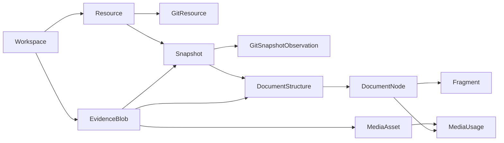

# Source Evidence Storage Contract

- Status: Frozen contract; M1C repository and import use case implemented
- Contract: `C-SLICE-A-EVIDENCE-r2`
- Date: 2026-08-11
- Scope: First PostgreSQL schema and application boundary for source evidence
- Migration reservation: `000002_create_source_evidence_schema.sql`

This contract turns the accepted evidence model into the smallest database
boundary needed before import, parsing, curation, or browser work can proceed.
It does not change the accepted architecture and does not claim that real
PostgreSQL execution has passed.

Revision 2 changes only the application validation contract for portable
Resource source keys. It does not change the PostgreSQL schema, migration bytes,
or any other revision 1 semantic.

Implementation note (2026-08-16): M1C implements this graph through a public
Evidence repository port and PostgreSQL adapter. Forward migration
`000005_create_evidence_capture_command.sql` adds only the durable
`(workspace_id, command_idempotency_key) → request_sha256` receipt needed for
restart-safe import replay; it does not alter `000002` or store source bytes.
Raw and normalized bytes remain in the external content-addressed Blob store.

## Scope

This revision covers:

- a stable workspace boundary;
- workspace-authorized logical Blob metadata over the existing content-addressed
  byte store;
- stable source resources and immutable content snapshots;
- portable, adapter-owned source identities that do not retain machine paths;
- exact Git source observations for the first source adapter;
- versioned deterministic document structures;
- ordered document nodes and Unicode code-point Fragments;
- media identity, document placement, and purpose provenance; and
- database constraints needed to prevent cross-workspace references and common
  duplicate side effects.

This revision does not cover:

- `Operation`, fetch scheduling, or background-job state;
- HTTP, WebSocket, authentication, CSRF, or browser behavior;
- content classification, intake decisions, assessments, or preferences;
- formal knowledge, citations, change sets, or search projections;
- DOM, PDF-page, OCR, audio, video, or image-region locator implementations;
- Blob garbage collection, backup execution, or workspace deletion workflows;
- runtime-role grants; and
- any real source record, personal value, fetched body, or media fixture.

Those capabilities use later forward migrations and application contracts. A
missing capability must not be represented by an unconstrained JSON column in
this migration.

## Object graph

Every arrow that crosses a workspace-owned table is backed by a foreign key
whose first column is `workspace_id`.

## PostgreSQL table contract

All names below are in the existing `struinfo` schema. Identifiers are supplied
by the application as `uuid`; the migration does not install an ID-generating
extension. Definite instants use `timestamp with time zone`. Append-only rows
have `created_at` but no generic `updated_at` field.

### `workspace`

| Column         | Contract                                      |
| -------------- | --------------------------------------------- |
| `workspace_id` | Primary key; stable application-supplied UUID |
| `created_at`   | Database timestamp for row creation           |

A display name, personal defaults, source list, and user preferences are
workspace data added through later use cases, not migration seed values.

### `evidence_blob`

| Column                    | Contract                                                |
| ------------------------- | ------------------------------------------------------- |
| `workspace_id`, `blob_id` | Composite primary key                                   |
| `digest_algorithm`        | System protocol value; revision 1 accepts only `sha256` |
| `digest`                  | Lowercase 64-character SHA-256 digest                   |
| `byte_length`             | Non-negative byte count                                 |
| `media_type`              | Optional detected media type; not part of byte identity |
| `read_revoked_at`         | Optional instant after which ordinary reads are denied  |
| `delete_after`            | Optional earliest physical-cleanup instant              |
| `created_at`              | Database timestamp for logical registration             |

`(workspace_id, digest_algorithm, digest)` is unique. An additional unique key
containing workspace, logical ID, digest, and byte length supports exact foreign
keys from evidence rows. Physical bytes may be deduplicated by digest, but this
table is the workspace authorization boundary; callers never authorize a read
using a digest or filesystem path alone.

### `resource` and `git_resource`

`resource` has composite primary key `(workspace_id, resource_id)`, a constrained
system `resource_kind`, an adapter-owned deterministic and portable opaque
`source_key`, an optional canonical URI, and `created_at`.
`(workspace_id, resource_kind, source_key)` is unique.

Revision 2 retains the revision 1 protocol kinds needed by the near-term import
boundary, such as `git_file`, `manual_text`, and `uploaded_file`. These are
transport or evidence kinds, not user content classifications.

`source_key` is an identity assigned by its adapter, not a filesystem locator.
The closed application boundary rejects:

- a Windows drive prefix such as an ASCII letter followed by `:`;
- a UNC, Windows-rooted, or POSIX-absolute form;
- any Windows backslash path form; and
- a literal `.` or `..` segment when the value is segmented by `/` or `\`.

Colons and forward slashes remain permitted in otherwise valid portable keys;
for example, an adapter namespace may use an opaque shape such as
`adapter:record/item`. A local-file adapter uses an upload registration ID,
adapter record ID, content identity, or another portable opaque key. It never
copies the original local path into `source_key`.

If a later use case must retain an original local path, a superseding contract
defines a private typed locator with explicit export and log-redaction rules.
The path must not be overloaded into `source_key`. Canonical URI behavior is
unchanged: it remains a separately validated field, and `file:` URIs are still
rejected.

These source-key rules are application validation. Revision 2 deliberately
leaves migration `000002_create_source_evidence_schema.sql`, its column types,
and `(workspace_id, resource_kind, source_key)` uniqueness byte-identical.

`git_resource` is a typed extension with a one-to-one workspace-scoped foreign
key to a `git_file` resource. It records the canonical repository URI and
repository-relative path, with a workspace-scoped uniqueness rule over those
two fields. Application validation enforces that the referenced resource kind
is `git_file`; the first migration must not add a trigger solely for this
cross-row type assertion.

### `snapshot` and `git_snapshot_observation`

`snapshot` has:

- composite primary key `(workspace_id, snapshot_id)`;
- an exact workspace-scoped foreign key to its Resource;
- a required lowercase SHA-256 hash of the exact captured content;
- an optional exact logical Blob binding for retained raw bytes;
- a required canonical-content SHA-256 and canonicalization version;
- optional media type and publication fields;
- an explicit `captured_at`; and
- a database `created_at`.

`(workspace_id, resource_id, raw_sha256)` is unique, so observing unchanged bytes
does not create another content version. If `raw_blob_id` is present, a composite
foreign key also proves that the registered Blob digest and byte length are the
identity used by the Snapshot.

Publication time keeps the instant, source timezone, precision, source text,
and inference flag separate. The database rejects a timezone or precision
without an instant. A date-only source may use an instant plus `day` precision;
consumers display the declared precision rather than inventing second-level
accuracy.

`git_snapshot_observation` is append-only and may have multiple rows for one
Snapshot. It records a stable observation ID, Resource and Snapshot binding,
repository ref, Git commit hash algorithm and digest, optional Git Blob object
identity, and `observed_at`. This separation preserves a later unchanged Git
commit observation without manufacturing a duplicate Snapshot. Repeating the
same repository/ref/commit observation is unique within the workspace.
Revision 2 retains lowercase `sha1` with 40 hexadecimal digits or lowercase
`sha256` with 64 hexadecimal digits. The algorithm token and digest together
form the Git object identity; callers never infer an algorithm from length.

### `document_structure` and `document_node`

`document_structure` identifies one immutable deterministic representation of a
Snapshot. It records:

- workspace, Resource, Snapshot, and structure IDs;
- parser name and parser version;
- text normalization version and UTF-8 text Blob identity;
- a SHA-256 digest of the canonical structure output; and
- `created_at`.

The exact text Blob foreign key and the Resource/Snapshot foreign key are both
workspace-scoped. Parser identity, normalization version, and structure digest
form the idempotency identity for one Snapshot. Fixing parser behavior requires
a new parser version or structure row; it never overwrites an accepted
representation.

`document_node` has a composite workspace/structure/node identity, an optional
parent in the same structure, a constrained structural kind, zero-based sibling
ordinal, a non-empty half-open Unicode code-point range, optional one-based line
range with an inclusive end, and `created_at`. Parent and child cannot cross
structures. A uniqueness rule over structure, parent, and ordinal treats a null
parent as a real value so that sibling order and the single root position remain
deterministic.

The database cannot express a general acyclic-tree assertion with an ordinary
foreign key. The deterministic parser and repository must reject cycles and
must require exactly one root before committing the structure transaction.

### `fragment`

Revision 2 retains the locator needed by the fixed Markdown source:
`unicode_code_point_range` version 1.

Each Fragment contains:

- workspace, Fragment, Resource, Snapshot, structure, node, and text Blob IDs;
- the locator kind and version;
- a non-empty half-open Unicode code-point range;
- an optional one-based line range with an inclusive end;
- the lowercase SHA-256 of the selected UTF-8 text; and
- `created_at`.

Composite foreign keys bind the Fragment to one workspace, Resource, Snapshot,
document structure, node, and exact text Blob. The range is interpreted over
Unicode code points in the structure's referenced normalized UTF-8 text, not
UTF-16 code units, bytes, or grapheme clusters. The writer must slice that text,
encode the selected value as UTF-8, verify `selected_text_sha256`, and reject an
out-of-range or mismatched locator before commit.

When a node or Fragment carries a line range, it is not an approximate display
hint. Line 1 starts at code point 0, each LF code point terminates its current
line, and the inclusive range runs from the line containing `start` through the
line containing `end - 1`. The writer derives this range from the normalized
text and rejects a supplied range that does not match the code-point locator.

The database enforces range shape and duplicate identity; semantic slicing is
an application invariant covered by pure tests now and real PostgreSQL tests
after the container gate. Future DOM, page, image-region, and time-range
locators use dedicated typed tables or a reviewed superseding contract rather
than arbitrary locator JSON.

### `media_asset` and `media_usage`

`media_asset` has a composite workspace ID, a storage mode, optional exact Blob
identity, optional original URI, optional media type and pixel dimensions, and
`created_at`.

- `stored_blob` requires the complete Blob identity.
- `external_reference` requires an original URI and leaves Blob identity null.

The two modes are visibly different; a referenced URL is never reported as
captured bytes. Stored assets deduplicate by workspace and digest. Pixel
dimensions are either both absent or both positive.

`media_usage` binds an asset to one Resource, Snapshot, document structure, and
node with a stable ordinal. It records a constrained purpose, purpose origin,
optional confidence, optional superseded usage ID, and `created_at`.

Revision 2 retains the purpose values `cover`, `concept_explanation`,
`data_visualization`, `screenshot`, `example`, `decorative`, and `unknown`.
Origin values distinguish `source_statement`, `deterministic_parser`,
`ai_inference`, `user_confirmation`, and `unknown`. Confidence is permitted only
for `ai_inference` and is inclusively between 0 and 1. A correction appends
another usage that references the previous row; it does not overwrite the
evidence position.
Later knowledge citation logic must reject `decorative` usage as factual
evidence.

## Cross-cutting invariants

The migration and all repositories preserve these rules:

1. Every workspace-owned primary key, lookup, uniqueness rule, idempotency
   identity, and foreign key includes `workspace_id`.
2. No foreign key uses `ON DELETE CASCADE`; evidence removal is an explicit,
   audited retention workflow.
3. Snapshot, Git observation, document structure, node, Fragment, MediaAsset,
   and MediaUsage rows are append-only through ordinary application ports.
4. No table stores raw source bodies or media bytes; those remain Blob-store
   bytes referenced by exact logical identity.
5. No table or migration contains a real source, personal classification,
   preference, path, snapshot, seed, or credential.
6. Stable IDs are opaque application values. A URL, branch, path, digest, or
   display label is not an authorization boundary.
7. Source URL, captured Snapshot, canonical document structure, and formal
   knowledge remain different objects.
8. Repeated equal input resolves to the existing logical rows. A reused stable
   ID or idempotency identity with different immutable content fails visibly;
   it is not converted into an update.
9. Filesystem Blob persistence and PostgreSQL commit are not falsely described
   as one atomic transaction. The writer stores immutable bytes first, commits
   all relational evidence in one database transaction, and permits later
   garbage collection of unreferenced bytes after the retention window.
10. Migration files are immutable and forward-only. Reversal uses a reviewed
    compensation migration or a consistent PostgreSQL-plus-Blob restore.

## Application boundary for the next implementation task

The concrete deterministic Markdown transformation layered on this evidence
model is frozen in
[`C-SLICE-A-MARKDOWN-r2`](deterministic-markdown-structure-contract.md).
That contract does not change this migration or add a table: it first produces
an ID-independent parse result, then purely materializes the existing evidence
DTOs.

The evidence module exposes domain input and result types independent of
NestJS, PostgreSQL, Drizzle, the filesystem adapter, and AI providers. The first
write use case will eventually accept one closed capture command containing:

- effective workspace identity;
- caller-supplied stable IDs and command idempotency identity;
- exact Blob identities already returned by the Blob store;
- Resource, its portable adapter-owned source identity, and source-observation
  identity;
- Snapshot hashes and time metadata;
- one deterministic document structure with ordered nodes and Fragments; and
- zero or more media assets and usages.

At the TypeScript boundary, closed means ordinary own-data-property records,
dense ordinary arrays, declared fields only, and an ordinary non-shared
`Uint8Array` when normalized bytes are supplied for locator validation. Unknown
or inherited fields, symbol keys, accessors, proxies, sparse arrays, and shared
or aliased byte views fail validation; validation does not execute caller-owned
accessors. The normalized bytes are defensively copied for validation and are
not part of the relational value returned for persistence.

The command idempotency identity is
`(workspace_id, command_idempotency_key)`. Replaying that identity with equal
immutable input returns the existing result, while different immutable input
returns a visible conflict. A different command key may resolve to existing
logical rows when every reused stable and natural identity has equal immutable
content; it does not create duplicate rows. Reusing either identity with changed
content remains a conflict.

The repository implementation commits that graph atomically or returns a stable
validation, conflict, or persistence failure. No source or AI adapter receives
table access. This contract revision freezes storage semantics, not a public
HTTP shape; M1C defines the minimal HTTP use cases above this port without
changing the storage contract or introducing another direct table-writing path.

## Verification boundary

Before a real PostgreSQL fixture is admitted, tracked checks may prove only:

- migration discovery, ordering, exact-byte hashing, and static presence of the
  material table/constraint contract;
- pure domain validation for source-key portability, digests, ranges, Git
  identities, media modes, and workspace-consistent aggregate references; and
- that ordinary runtime entrypoints still neither run migrations nor issue DDL.

They must not claim that PostgreSQL accepted the DDL, enforced the constraints,
or separated runtime grants. After `M0-S-CONTAINER-MAINT-001` (or a named
replacement gate) is accepted, real integration coverage must include fresh
apply, upgrade from migration 000001, repeated no-op migration, cross-workspace
negative references, duplicate/equal versus conflicting identities, parent and
range constraints, transaction rollback, and runtime-role mutation limits.

The M1C functional smoke has now established a deliberately narrower real
PostgreSQL fact: PostgreSQL 18 accepted exact migrations `000001`–`000005`, the
runner's second invocation was a no-op, and the application adapter committed,
replayed, rejected a changed same-key command, and reopened two isolated
synthetic workspaces. This is product-path evidence only. It does not certify
the complete catalog, least-privilege, concurrency, container/Linux, or formal
TM2 matrix described above.

## References

- [Product requirements](product-requirements.md)
- [Roadmap](roadmap.md)
- [Knowledge core architecture](knowledge-core-architecture.md)
- [Database migrations and roles](database-migrations-and-roles.md)
- [ADR 0002](adr/0002-postgresql-persistence-and-durable-work.md)
- [ADR 0005](adr/0005-versioned-knowledge-core-and-ai-optional-operations.md)
- [ADR 0006](adr/0006-external-configuration-and-personal-data-isolation.md)
